# Notebook Analysis Summary

- **Total Cells:** 123
- **Images/Plots Extracted:** 21
- **Image Directory:** `AnothercopyofAIML_ML_Project_Full_Code_Notebook_images`

---

### Cell 1 [Type: Markdown]

**Input:**
```
Problem Statement¶
```

---
### Cell 2 [Type: Markdown]

**Input:**
```
Context¶
```

---
### Cell 3 [Type: Markdown]

**Input:**
```
AllLife Bank is a mid-sized, fast-growing US-based financial institution that offers a range of retail banking services, including savings and checking accounts, fixed deposits, and personal loans. The bank’s business model is centered on building long-term customer relationships, expanding its retail footprint, and growing its loan portfolio to drive sustainable profitability through interest income.
It currently relies on a large base of liability customers (depositors) but faces a significant under-representation of asset customers (borrowers). To drive profitability through interest income, the bank must aggressively expand its loan portfolio by converting existing depositors into personal loan customers.
Last year’s pilot campaign achieved a 9% conversion rate, validating the potential of this strategy. However, to optimize marketing spend and improve efficiency, the retail marketing department requires a more data-driven approach. Enhancing the success ratio of these campaigns is critical for sustainable growth and maximizing customer lifetime value.
```

---
### Cell 4 [Type: Markdown]

**Input:**
```
Objective¶
```

---
### Cell 5 [Type: Markdown]

**Input:**
```
The objective is to develop a predictive classification model that identifies patterns and key factors driving personal loan adoption among existing liability customers. By uncovering the demographic and behavioral drivers of loan conversion, the goal is to enable targeted segmentation and more precise marketing interventions that improve campaign conversion rates, optimize marketing spend, and enhance overall profitability through higher-quality loan portfolio growth.
```

---
### Cell 6 [Type: Markdown]

**Input:**
```
Data Dictionary¶
```

---
### Cell 7 [Type: Markdown]

**Input:**
```
ID: Customer ID
Age: Customer’s age in completed years
Experience: #years of professional experience
Income: Annual income of the customer (in thousand dollars)
ZIP Code: Home Address ZIP code.
Family: the Family size of the customer
CCAvg: Average spending on credit cards per month (in thousand dollars)
Education: Education Level. 1: Undergrad; 2: Graduate;3: Advanced/Professional
Mortgage: Value of house mortgage if any. (in thousand dollars)
Personal_Loan: Did this customer accept the personal loan offered in the last campaign? (0: No, 1: Yes)
Securities_Account: Does the customer have securities account with the bank? (0: No, 1: Yes)
CD_Account: Does the customer have a certificate of deposit (CD) account with the bank? (0: No, 1: Yes)
Online: Do customers use internet banking facilities? (0: No, 1: Yes)
CreditCard: Does the customer use a credit card issued by any other Bank (excluding All life Bank)? (0: No, 1: Yes)
```

---
### Cell 8 [Type: Markdown]

**Input:**
```
Importing necessary libraries¶
```

---
### Cell 9 [Type: Code]

**Input:**
```
#Installing the libraries with the specified version
!pip install numpy==2.0.2 pandas==2.2.2 matplotlib==3.10.0 seaborn==0.13.2 scikit-learn==1.6.1 sklearn-pandas==2.2.0 -q --user
```

---
### Cell 10 [Type: Markdown]

**Input:**
```
Note:

After running the above cell, kindly restart the notebook kernel (for Jupyter Notebook) or runtime (for Google Colab), write the relevant code for the project from the next cell, and run all cells sequentially from the next cell.

On executing the above line of code, you might see a warning regarding package dependencies. This error message can be ignored as the above code ensures that all necessary libraries and their dependencies are maintained to successfully execute the code in this notebook.
```

---
### Cell 11 [Type: Code]

**Input:**
```
#libraries to help with reading and manipulating data
import pandas as pd
import numpy as np

#libaries to help with data visualization
import matplotlib.pyplot as plt
import seaborn as sns

#libraries to help with data preprocessing
import matplotlib.patches as mpatches
from matplotlib.ticker import FuncFormatter

#removes the limit for the number of displayed columns
pd.set_option("display.max_columns", None)
# Sets the limit for the number of displayed rows
pd.set_option("display.max_rows", 200)

#library to split data
from sklearn.model_selection import train_test_split

#to build model for prediction
from sklearn.tree import DecisionTreeClassifier
from sklearn import tree

#to tune different models
from sklearn.model_selection import GridSearchCV

#to get diferent scores
from sklearn.metrics import (
    f1_score,
    accuracy_score,
    recall_score,
    precision_score,
    confusion_matrix,
    make_scorer,
    classification_report,
)

#suppress warnings
import warnings
warnings.filterwarnings("ignore", category= FutureWarning)
```

---
### Cell 12 [Type: Markdown]

**Input:**
```
Loading the dataset¶
```

---
### Cell 13 [Type: Code]

**Input:**
```
#read the dataset from the Loan_Modelling.csv file locally. Pandas DataFrame object
#assigned to personal_loan_df
personal_load_df_original = pd.read_csv("/content/Loan_Modelling.csv")

#create a copy of the original DataFrame to avoid modifying the original data
personal_loan_df = personal_load_df_original.copy()
```

---
### Cell 14 [Type: Markdown]

**Input:**
```
You can upload the Loan_Modelling.csv file directly using the following code cell. Once executed, a button will appear that allows you to browse and select the file from your local system. Alternatively, you can drag and drop the file into the Colab file browser on the left sidebar.
After uploading, you can then re-run the cell veW9EM12yd5M to load the data.
```

---
### Cell 15 [Type: Markdown]

**Input:**
```
Data Overview¶
```

---
### Cell 16 [Type: Markdown]

**Input:**
```
Observations
Sanity checks
```

---
### Cell 17 [Type: Code]

**Input:**
```
#display the first 5 rows of the DataFrame
print('First 5 rows of the dataset:')
print(personal_loan_df.head(5).to_string(index=False))
print("\n")

#display the concise summary of the DataFrame
print("Concise summary of the DataFrame:")
personal_loan_df.info()

print("\n")

#display the shape of the DataFrame.
print("Shape of the DataFrame:")
print(personal_loan_df.shape)
```

**Output:**
```
First 5 rows of the dataset:
 ID  Age  Experience  Income  ZIPCode  Family  CCAvg  Education  Mortgage  Personal_Loan  Securities_Account  CD_Account  Online  CreditCard
  1   25           1      49    91107       4    1.6          1         0              0                   1           0       0           0
  2   45          19      34    90089       3    1.5          1         0              0                   1           0       0           0
  3   39          15      11    94720       1    1.0          1         0              0                   0           0       0           0
  4   35           9     100    94112       1    2.7          2         0              0                   0           0       0           0
  5   35           8      45    91330       4    1.0          2         0              0                   0           0       0           1


Concise summary of the DataFrame:
<class 'pandas.core.frame.DataFrame'>
RangeIndex: 5000 entries, 0 to 4999
Data columns (total 14 columns):
 #   Column              Non-Null Count  Dtype  
---  ------              --------------  -----  
 0   ID                  5000 non-null   int64  
 1   Age                 5000 non-null   int64  
 2   Experience          5000 non-null   int64  
 3   Income              5000 non-null   int64  
 4   ZIPCode             5000 non-null   int64  
 5   Family              5000 non-null   int64  
 6   CCAvg               5000 non-null   float64
 7   Education           5000 non-null   int64  
 8   Mortgage            5000 non-null   int64  
 9   Personal_Loan       5000 non-null   int64  
 10  Securities_Account  5000 non-null   int64  
 11  CD_Account          5000 non-null   int64  
 12  Online              5000 non-null   int64  
 13  CreditCard          5000 non-null   int64  
dtypes: float64(1), int64(13)
memory usage: 547.0 KB


Shape of the DataFrame:
(5000, 14)
```

---
### Cell 18 [Type: Code]

**Input:**
```
#determine if there is any missing data
missing_values = personal_loan_df.isnull().sum()

#check for nulls and NaN values in the dataset
print('Null values ' + str(personal_loan_df.isnull().sum()) + '\n')
print('NaN values ' + str(personal_loan_df.isna().sum()) + '\n')

#output if there are any missing data points in the dataset
if missing_values.sum() > 0:
    print('There are missing data points in the Personal Loan dataset.')
else:
    print('There are no missing data points in the Personal Load dataset.')
```

**Output:**
```
Null values ID                    0
Age                   0
Experience            0
Income                0
ZIPCode               0
Family                0
CCAvg                 0
Education             0
Mortgage              0
Personal_Loan         0
Securities_Account    0
CD_Account            0
Online                0
CreditCard            0
dtype: int64

NaN values ID                    0
Age                   0
Experience            0
Income                0
ZIPCode               0
Family                0
CCAvg                 0
Education             0
Mortgage              0
Personal_Loan         0
Securities_Account    0
CD_Account            0
Online                0
CreditCard            0
dtype: int64

There are no missing data points in the Personal Load dataset.
```

---
### Cell 19 [Type: Code]

**Input:**
```
#retrieve full statistics of the dataset
personal_loan_df.describe()
```

---
### Cell 20 [Type: Code]

**Input:**
```
#using the describe() function with (include-'all')
personal_loan_df.describe(include='all').T
```

---
### Cell 21 [Type: Code]

**Input:**
```
#drop the ID column from the dataset
if 'ID' in personal_loan_df.columns:
    personal_loan_df.drop(['ID'], axis=1, inplace=True)

#retrieve the first 5 rows of the dataset after dropping ID
print('First 5 rows of the dataset after dropping the ID column:')
print(personal_loan_df.head(5).to_string(index=False))
```

**Output:**
```
First 5 rows of the dataset after dropping the ID column:
 Age  Experience  Income  ZIPCode  Family  CCAvg  Education  Mortgage  Personal_Loan  Securities_Account  CD_Account  Online  CreditCard
  25           1      49    91107       4    1.6          1         0              0                   1           0       0           0
  45          19      34    90089       3    1.5          1         0              0                   1           0       0           0
  39          15      11    94720       1    1.0          1         0              0                   0           0       0           0
  35           9     100    94112       1    2.7          2         0              0                   0           0       0           0
  35           8      45    91330       4    1.0          2         0              0                   0           0       0           1
```

---
### Cell 22 [Type: Code]

**Input:**
```
#find correlation between the variables in the dataset
personal_loan_df.corr()
```

---
### Cell 23 [Type: Code]

**Input:**
```
#calculate the distribution of mortgages
mortgage_distribution = personal_loan_df['Mortgage'].value_counts()

#sort the distribution in descending order
mortgage_distribution_sorted = mortgage_distribution.sort_values(ascending=False)

#Format the mortgage values into dollars
mortgage_distribution_sorted.index = mortgage_distribution_sorted.index.map(lambda x: f'${x:,.0f}K')

#print the distribution of mortgages
print('Distribution of Mortgages (descending order):')
print(mortgage_distribution_sorted)
```

**Output:**
```
Distribution of Mortgages (descending order):
Mortgage
$0K      3462
$98K       17
$119K      16
$91K       16
$83K       16
         ... 
$452K       1
$477K       1
$432K       1
$590K       1
$541K       1
Name: count, Length: 347, dtype: int64
```

---
### Cell 24 [Type: Code]

**Input:**
```
#create a cross-tabulation of ZIP code and Education
zip_education_crosstab = pd.crosstab(personal_loan_df['ZIPCode'], personal_loan_df['Education'])

#filter rows where education level count is greater than 20
zipcode_education_sorted = zip_education_crosstab[zip_education_crosstab > 20].dropna(how='all')

#print the ZIP code and Education cross
print('Cross-tabulation of ZIP code and Education:')
print(zipcode_education_sorted.to_string())
```

**Output:**
```
Cross-tabulation of ZIP code and Education:
Education     1     2     3
ZIPCode                    
90089      22.0   NaN   NaN
90095      25.0   NaN  26.0
90245       NaN   NaN  21.0
91320      22.0   NaN   NaN
92037      25.0   NaN   NaN
92121      25.0   NaN   NaN
93106       NaN   NaN  22.0
93943      28.0   NaN   NaN
94025       NaN   NaN  22.0
94305      51.0  40.0  36.0
94720      68.0  49.0  52.0
95616      47.0  36.0  33.0
```

---
### Cell 25 [Type: Code]

**Input:**
```
#check for zero or negative values in columns
columns_to_check = ['Income', 'CCAvg', 'Mortgage','Securities_Account', 'CD_Account', 'Online', 'CreditCard']
for column in columns_to_check:
    invalid_values = personal_loan_df[personal_loan_df[column] <= 0]
    print(f'Number of rows with non-positive values in {column}: {len(invalid_values)}')
```

**Output:**
```
Number of rows with non-positive values in Income: 0
Number of rows with non-positive values in CCAvg: 106
Number of rows with non-positive values in Mortgage: 3462
Number of rows with non-positive values in Securities_Account: 4478
Number of rows with non-positive values in CD_Account: 4698
Number of rows with non-positive values in Online: 2016
Number of rows with non-positive values in CreditCard: 3530
```

---
### Cell 26 [Type: Code]

**Input:**
```
#see if there is a correlation between Education level and Mortgage amount
#calculate the correlation between Mortgage and Education
correlation = personal_loan_df['Mortgage'].corr(personal_loan_df['Education'])

print(f"The correlation between Mortgage and Education is: {correlation}")
```

**Output:**
```
The correlation between Mortgage and Education is: -0.033327124629950425
```

---
### Cell 27 [Type: Markdown]

**Input:**
```
Observations¶General Dataset Overview

The Personal Loan dataset contains 5,000 records across 14 variables.

There are no missing or null values, indicating strong data completeness.


A majority of customers (3,462 individuals) do not have a mortgage.

ZIP code 94720 has the highest representation overall (169 customers).

ZIP code 94720 also has the highest count of education levels, including 68 undergraduate and 49 graduate individuals.


Feature-Level Insights

There is a strong positive correlation between Income and CCAvg, suggesting that higher-income customers tend to have higher credit card spending. Both variables are likely key predictors in financial behavior modeling.

Income shows moderate correlations with Personal Loan uptake and CCAvg, indicating that higher-income individuals may be strong candidates for loan products and credit card marketing campaigns.

The positive relationship between Securities_Account and CD_Account suggests customers who hold one financial product are more likely to hold the other. This presents an opportunity for bundled product offerings and cross-selling strategies.

ZIP Code Distribution Insights

The most represented ZIP codes are:

94720 (169 customers)

94305 (127 customers)

95616 (116 customers)

These areas account for a significant concentration of customers in the dataset.

The top 20 ZIP codes range in frequency from 169 to 34 customers, indicating clusters of higher representation across several regions.

The dataset appears geographically concentrated, particularly in ZIP code 94720, which may represent a strategic market segment.

While certain ZIP codes dominate, the presence of 20 high-frequency ZIP codes suggests reasonable geographic diversity.

The concentration of customers in specific ZIP codes indicates potential regional clustering that should be considered in modeling and targeting strategies.


Potential Regional Bias

The overrepresentation of certain ZIP codes suggests possible regional bias, which may stem from sampling methods or data collection practices.

This bias should be considered when generalizing insights or deploying predictive models across broader populations.

Mortgage Distribution Insights

The most common mortgage value is $0K (3,462 customers), confirming that a large portion of individuals do not carry mortgage debt.

Among non-zero mortgage amounts, frequencies drop sharply:

$98K (17 customers)

$119K, $91K, $103K (16 customers each)

There is a long tail distribution of mortgage values, with many amounts appearing only once (e.g., $281K, $577K, $302K, $405K, $541K).

The mortgage distribution is heavily right-skewed, with a dominant concentration at zero and sparse representation at higher values.

The correlation between Education and Mortgage (-0.0333) indicates no meaningful linear relationship between education level and mortgage amount.
```

---
### Cell 28 [Type: Markdown]

**Input:**
```
Exploratory Data Analysis.¶
```

---
### Cell 29 [Type: Markdown]

**Input:**
```
EDA is a critical step in any data project used to investigate and understand the data before model construction.
The following questions serve as a starting point to help you approach the analysis and generate initial insights:
Questions:

What is the distribution of mortgage attribute? Are there any noticeable patterns or outliers in the distribution?
How many customers have credit cards?
What are the attributes that have a strong correlation with the target attribute (personal loan)?
How does a customer's interest in purchasing a loan vary with their education?
How does a customer's interest in purchasing a loan vary with their age?

Additional Questions

What are all of the distributions?
Does income impact mortgage amount?
Does income reflect higher or lower average credit card spending?
What is the relationship between Personal Loan vs Education?
What is the relationship between Online Banking Usage vs Top 10 ZIP Codes?
What is the relationship between Online Banking Usage vs Education?
What is the relationship between having a Average Credit Card spending vs  Education?
```

---
### Cell 30 [Type: Markdown]

**Input:**
```
Question 1. What is the distribution of mortgage attribute? Are there any noticeable patterns or outliers in the distribution?
```

---
### Cell 31 [Type: Code]

**Input:**
```
#plot the distribution of mortgage histogram
plt.figure(figsize=(12, 6))
sns.histplot(personal_loan_df['Mortgage'], bins=30, kde=True)
plt.title('Distribution of Mortgage Attribute')
plt.xlabel('Mortgage')
plt.ylabel('Frequency')
plt.grid(True)
plt.show()


#plot the distribution of mortgage boxplot to identify outliers
plt.figure(figsize=(12, 6))
sns.boxplot(x=personal_loan_df['Mortgage'])
plt.title('Boxplot of Mortgage Attribute')
plt.xlabel('Mortgage')
plt.grid(True)
plt.show()
```

**Plots/Images (1):**
- `plot_000.png` (png)
  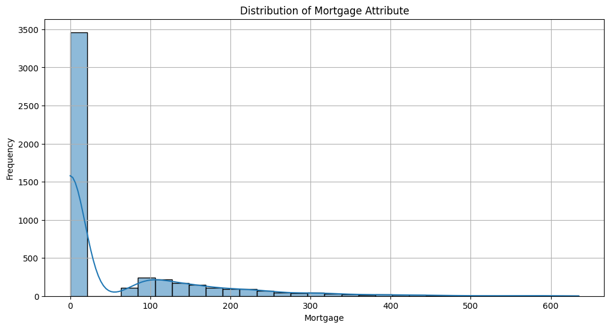

---
### Cell 32 [Type: Code]

**Input:**
```
#customers with no mortgage
no_mortgage_count = personal_loan_df[personal_loan_df['Mortgage'] == 0].shape[0]

#number of customers
total_customers = personal_loan_df.shape[0]

#percentage of customers with no mortgage
percentage_no_mortgage = (no_mortgage_count / total_customers) * 100

print(f"Number of customers with no mortgage: {no_mortgage_count:,}")
print(f"Total number of customers: {total_customers:,}")
print(f'Percentage of customers with no mortgage: {percentage_no_mortgage:.2f}%')
```

**Output:**
```
Number of customers with no mortgage: 3,462
Total number of customers: 5,000
Percentage of customers with no mortgage: 69.24%
```

---
### Cell 33 [Type: Markdown]

**Input:**
```
Observations

69.24% of customers do not have a mortgage ($0).
Recommendation: Market to these customers with a special program with low introductory rates.
```

---
### Cell 34 [Type: Markdown]

**Input:**
```
Question 2. How many customers have credit cards?¶
```

---
### Cell 35 [Type: Code]

**Input:**
```
#total number of customers
total_customers = personal_loan_df.shape[0]

#number of customers with credit cards from All Life Bank and other banks
other_cc = personal_loan_df[personal_loan_df['CreditCard'] == 1].shape[0]
all_life_bank_cc = personal_loan_df[personal_loan_df['CreditCard'] == 0].shape[0]

print(f'Number of customers with All Life Bank credit card: {all_life_bank_cc:,}')
print(f'Number of customers using a credit card at another bank: {other_cc:,}')
print(f'Total number of customers: {total_customers:,}')
print(f'Percentage of customers with credit cards: {(other_cc / total_customers * 100):.2f}%')
```

**Output:**
```
Number of customers with All Life Bank credit card: 3,530
Number of customers using a credit card at another bank: 1,470
Total number of customers: 5,000
Percentage of customers with credit cards: 29.40%
```

---
### Cell 36 [Type: Markdown]

**Input:**
```
Observations

29.4% of customers have credit cards from other banks
Recommendation: Market a special program with low introductory APR
```

---
### Cell 37 [Type: Markdown]

**Input:**
```
Question 3. What are the attributes that have a strong correlation with the target attribute (personal loan)?¶
```

---
### Cell 38 [Type: Code]

**Input:**
```
#find the highest correlated feature pairs in the personal_loan_df DataFrame
correlation_matrix = personal_loan_df.corr(numeric_only=True)

#unstack the correlation matrix
correlation_pairs = correlation_matrix.unstack()

#filter out self-correlations
filtered_pairs = correlation_pairs[correlation_pairs != 1]

#sort the correlations in descending order
sorted_pairs = filtered_pairs.sort_values(ascending=False)

#display the correlated feature pairs
highest_correlated_features = sorted_pairs.head(10)
print(highest_correlated_features)
```

**Output:**
```
Age                 Experience            0.994215
Experience          Age                   0.994215
CCAvg               Income                0.645984
Income              CCAvg                 0.645984
Personal_Loan       Income                0.502462
Income              Personal_Loan         0.502462
CCAvg               Personal_Loan         0.366889
Personal_Loan       CCAvg                 0.366889
Securities_Account  CD_Account            0.317034
CD_Account          Securities_Account    0.317034
dtype: float64
```

---
### Cell 39 [Type: Code]

**Input:**
```
#correlation matrix
correlation_matrix = personal_loan_df.corr(numeric_only=True)

#correlations with the target attribute (Personal Loan)
correlations_with_target = correlation_matrix['Personal_Loan'].drop('Personal_Loan')

#attributes with strong correlations
strong_correlations = correlations_with_target[correlations_with_target.abs() > 0.5]

#attributes with strong correlations with the target attribute
print("Attributes with strong correlation with the target attribute Personal_Loan):")
for attribute, correlation in strong_correlations.items():
    print(f"{attribute} with Correlation of {correlation}.")
```

**Output:**
```
Attributes with strong correlation with the target attribute Personal_Loan):
Income with Correlation of 0.502462292494936.
```

---
### Cell 40 [Type: Markdown]

**Input:**
```
Observations:
| Correlation Data | Value | Interpretation |
| ---- | --- | --- |
| Age and Experience | 0.994215 | There is an extremely high positive correlation between Age and Experience. This is expected as older individuals generally have more work experience. |
| Income and CCAvg | 0.645984 | There is a strong positive correlation between Income and CCAvg (Credit Card Average). This suggests that individuals with higher incomes tend to have higher average credit card spending. |
| Income and Personal_Loan | 0.502462 | There is a moderate positive correlation between Income and Personal_Loan. This indicates that individuals with higher incomes are more likely to have personal loans. |
| CCAvg and Personal_Loan | 0.366889 | There is a moderate positive correlation between CCAvg and Personal_Loan. This suggests that individuals with higher average credit card spending are somewhat more likely to have personal loans.
| Securities_Account and CD_Account | 0.317034 | There is a moderate positive correlation between Securities_Account and CD_Account. This indicates that individuals with a securities account are somewhat more likely to have a certificate of deposit (CD) account. |
```

---
### Cell 41 [Type: Markdown]

**Input:**
```
Question 4. How does a customer's interest in purchasing a loan vary with their age?¶
```

---
### Cell 42 [Type: Code]

**Input:**
```
#create age bins
bins = [20, 30, 40, 50, 60, 70]
labels = ['20-29', '30-39', '40-49', '50-59', '60-69']
personal_loan_df['AgeGroup'] = pd.cut(personal_loan_df['Age'], bins=bins, labels=labels, right=False)

#calculate the proportion of customers interested in loans for each age group
loan_interest_by_age = personal_loan_df.groupby('AgeGroup')['Personal_Loan'].mean()

#print proportion of customers interested in loans by age group
print("Loan Interest by Age Group")
print("-" * 60)
for age_group, proportion in loan_interest_by_age.items():
    print(f"Age Group: {age_group}, Proportion: {proportion}")

#visualize results
loan_interest_by_age.plot(kind='bar', colormap='viridis')
plt.xlabel('Age Group')
plt.ylabel('Proportion of Customers Interested in Loans')
plt.title('Customer Interest in Purchasing Loans by Age')
plt.show()
```

**Output:**
```
Loan Interest by Age Group
------------------------------------------------------------
Age Group: 20-29, Proportion: 0.10040983606557377
Age Group: 30-39, Proportion: 0.10184442662389735
Age Group: 40-49, Proportion: 0.09307875894988067
Age Group: 50-59, Proportion: 0.08845577211394302
Age Group: 60-69, Proportion: 0.10237388724035608
```

---
### Cell 43 [Type: Markdown]

**Input:**
```
Observations

No significant interest difference between age groups that are interested in a personal loan.
Customers broken down into age groups and their interest in loans:
Age Group 20-29: ~10.04%
Age Group 30-39: ~10.18%
Age Group 40-49: ~9.31%
Age Group 50-59: ~8.85%
Age Group 60-69: ~10.24%
```

---
### Cell 44 [Type: Markdown]

**Input:**
```
Question 5. How does a customer's interest in purchasing a loan vary with their education?¶
```

---
### Cell 45 [Type: Code]

**Input:**
```
#calculate the proportion of customers interested in loans for each education level
loan_interest_by_education = personal_loan_df.groupby('Education')['Personal_Loan'].mean()

#print proportion of customers interested in loans by education level
#1: Undergrad; 2: Graduate; 3: Advanced/Professional
print("Loan Interest by Education Level")
print("-" * 60)
for education_level, proportion in loan_interest_by_education.items():
    print(f"Education Level: {education_level}, Proportion: {proportion}")

#visualize results
loan_interest_by_education.plot(kind='bar', color=['red', 'green', 'blue'])
plt.xlabel('Education Level')
plt.ylabel('Proportion of Customers Interested in Loans')
plt.title('Customer Interest in Purchasing Loans by Education Level')
plt.show()
```

**Output:**
```
Loan Interest by Education Level
------------------------------------------------------------
Education Level: 1, Proportion: 0.044370229007633585
Education Level: 2, Proportion: 0.12972202423378476
Education Level: 3, Proportion: 0.13657561625582945
```

---
### Cell 46 [Type: Markdown]

**Input:**
```
Observations

Undergraduate customers show low interest in personal loans (4.44%), which may reflect existing financial obligations such as student debt or sensitivity to high interest rates and credit-related costs.

Recommendation: Consider introducing a tailored offering for this segment, such as a low-APR loan or a promotional period with reduced or deferred interest, to improve engagement and adoption.

Graduate (12.97%) and Advanced/Professional (13.66%) customers demonstrate significantly higher interest in personal loans. This trend may be attributed to greater financial stability, higher earning potential, and more established credit management practices.
```

---
### Cell 47 [Type: Code]

**Input:**
```
#group by age and calculate the mean interest in purchasing a loan
age_interest_df = personal_loan_df.groupby('Age')['Personal_Loan'].mean().reset_index()

#plot the results as a bar plot
plt.figure(figsize=(10, 6))
sns.barplot(x='Age', y='Personal_Loan', data=age_interest_df, palette='viridis')

#add labels and title
plt.title("Customer's Interest in a Loan by Age")
plt.xlabel('Age')
plt.ylabel('Interest in Purchasing a Loan')
plt.grid(axis='y', linestyle='--', alpha=0.7)
plt.xticks(rotation=45, ha='right')
plt.tight_layout()
plt.show()
```

**Plots/Images (1):**
- `plot_001.png` (png)
  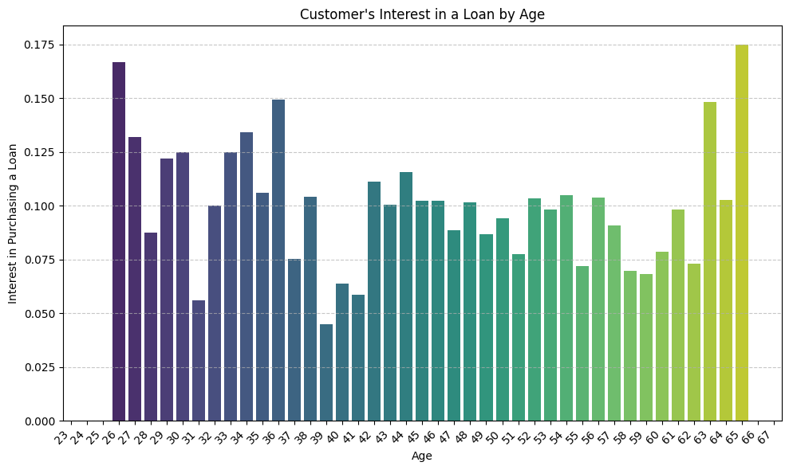

---
### Cell 48 [Type: Markdown]

**Input:**
```
Question 6. What are all of the distributions?¶
```

---
### Cell 49 [Type: Code]

**Input:**
```
#distributions

#age
sns.histplot(personal_loan_df['Age'], kde=True)
plt.title('Age Distribution')
plt.show()

#income
sns.histplot(personal_loan_df['Income'], kde=True)
plt.title('Income Distribution')
plt.show()

#CCAvg
sns.histplot(personal_loan_df['CCAvg'], kde=True)
plt.title('CCAvg Distribution')
plt.show()

#mortgage
sns.histplot(personal_loan_df['Mortgage'], kde=True)
plt.title('Mortgage Distribution')
plt.show()
```

**Plots/Images (1):**
- `plot_002.png` (png)
  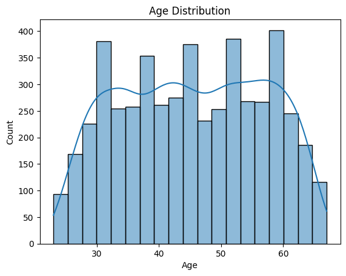

---
### Cell 50 [Type: Code]

**Input:**
```
#calculate the percentage of each family size.
family_counts = personal_loan_df['Family'].value_counts(normalize=True) * 100

#ensure the values are in order
family_counts = family_counts.sort_index()

#create the barplot.
sns.barplot(x=family_counts.index, y=family_counts.values, palette="viridis")
plt.title('Family Size Distribution')
plt.xlabel('Family Size')
plt.ylabel('Percentage')

#add percentages on top of the bars.
for index, value in enumerate(family_counts.values):
    plt.text(index, value + 0.5, f'{value:.2f}%', ha='center')

plt.show()
```

**Plots/Images (1):**
- `plot_003.png` (png)
  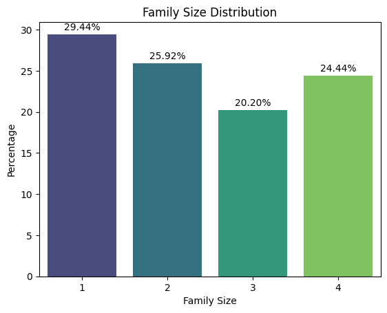

---
### Cell 51 [Type: Code]

**Input:**
```
#create a histogram plot for Income.
sns.histplot(data=personal_loan_df, x='Income', kde=True, bins=30, color='blue')
plt.title('Income Distribution')
plt.xlabel('Income')
plt.ylabel('Frequency')
plt.show()
```

**Plots/Images (1):**
- `plot_004.png` (png)
  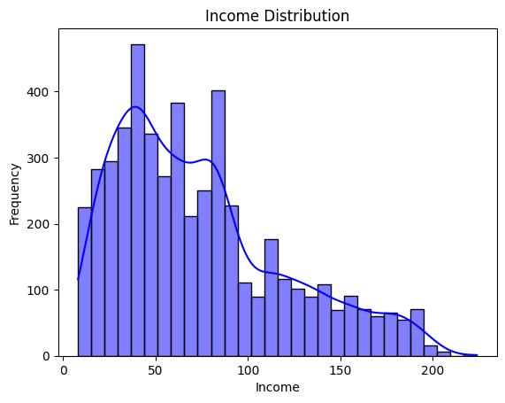

---
### Cell 52 [Type: Code]

**Input:**
```
#calculate the total counts of each ZIP code.
zipcode_counts = personal_loan_df['ZIPCode'].value_counts()

#calculate the percentage for each ZIP code.
zipcode_percentages = (zipcode_counts / zipcode_counts.sum()) * 100

#select the top 50 ZIP codes.
top_50_zipcodes = zipcode_counts.head(50)
top_50_percentages = zipcode_percentages.head(50)

#convert the result to a DataFrame.
top_50_zipcode_df = pd.DataFrame({
    'ZIPCode': top_50_zipcodes.index,
    'Count': top_50_zipcodes.values,
    'Percentage': top_50_percentages.values
})

#format the 'Percentage' column to two decimal places.
top_50_zipcode_df['Percentage'] = top_50_zipcode_df['Percentage'].map('{:.2f}%'.format)

#display the DataFrame as a table.
print(top_50_zipcode_df)
```

**Output:**
```
ZIPCode  Count Percentage
0     94720    169      3.38%
1     94305    127      2.54%
2     95616    116      2.32%
3     90095     71      1.42%
4     93106     57      1.14%
5     93943     54      1.08%
6     92037     54      1.08%
7     91320     53      1.06%
8     91711     52      1.04%
9     94025     52      1.04%
10    92093     51      1.02%
11    90024     50      1.00%
12    90245     50      1.00%
13    91330     46      0.92%
14    90089     46      0.92%
15    92121     45      0.90%
16    94304     45      0.90%
17    94143     37      0.74%
18    95051     34      0.68%
19    94608     34      0.68%
20    92028     32      0.64%
21    92182     32      0.64%
22    92521     32      0.64%
23    95054     31      0.62%
24    95814     30      0.60%
25    95014     29      0.58%
26    94301     27      0.54%
27    94550     27      0.54%
28    94542     27      0.54%
29    95039     26      0.52%
30    94501     26      0.52%
31    95064     26      0.52%
32    93407     26      0.52%
33    95819     26      0.52%
34    95060     25      0.50%
35    91107     25      0.50%
36    94022     25      0.50%
37    94303     25      0.50%
38    94105     25      0.50%
39    93117     24      0.48%
40    94596     24      0.48%
41    93555     23      0.46%
42    94080     23      0.46%
43    95521     23      0.46%
44    92612     22      0.44%
45    92717     22      0.44%
46    91380     22      0.44%
47    94110     21      0.42%
48    91768     21      0.42%
49    92647     21      0.42%
```

---
### Cell 53 [Type: Code]

**Input:**
```
#income vs Personal Loan Acceptance.
sns.boxplot(x='Personal_Loan', y='Income', data=personal_loan_df, palette='viridis', showmeans=True, meanprops={"marker":"o","markerfacecolor":"white", "markeredgecolor":"black"})
plt.title('Income vs Personal Loan Acceptance')
plt.show()
```

**Plots/Images (1):**
- `plot_005.png` (png)
  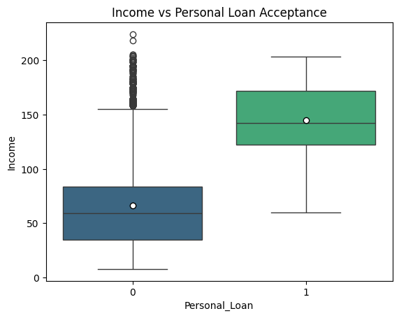

---
### Cell 54 [Type: Markdown]

**Input:**
```
Observations:¶
The dataset primarily represents a middle-aged working population, which is consistent with financial product datasets such as loans and credit services.
The dataset is dominated by moderate-income individuals, with relatively fewer high-income earners. This right-skewed pattern is typical in income data and may influence modeling strategies, particularly for loan targeting and credit behavior analysis.
The dataset reflects a fairly even distribution of household sizes, with a slight concentration among smaller households (1–2 members). This may influence financial product preferences, spending patterns, and loan eligibility considerations.
The dataset is primarily composed of moderate-income individuals, with fewer high-income earners. This skewed income distribution is typical in financial datasets and may influence targeting strategies, credit risk assessment, and loan modeling decisions.
Higher income appears to be strongly associated with personal loan acceptance, making income a key variable for targeting and predictive modeling efforts.
```

---
### Cell 55 [Type: Markdown]

**Input:**
```
Question 7. Does income impact mortgage amount?¶
```

---
### Cell 56 [Type: Code]

**Input:**
```
#create a scatter plot showinbg the relationship between income and mortgage.
plt.figure(figsize=(10, 6))
sns.scatterplot(x='Income', y='Mortgage', data=personal_loan_df)

#add titles and labels.
plt.title('Income vs Mortgage')
plt.xlabel('Income')
plt.ylabel('Mortgage')

#show the plot.
plt.show()
```

**Plots/Images (1):**
- `plot_006.png` (png)
  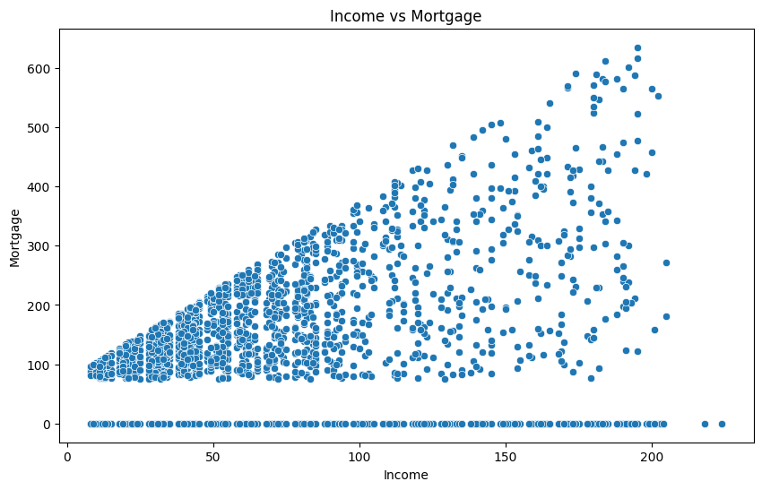

---
### Cell 57 [Type: Markdown]

**Input:**
```
Observation¶There is a clear positive relationship between income and mortgage amounts. As income increases, mortgage values generally increase.

Lower-income individuals tend to have smaller mortgage balances, while higher-income individuals are more likely to carry larger mortgages.

There is a noticeable cluster of individuals with zero mortgage across all income levels, indicating that income alone does not determine mortgage ownership.

The spread of mortgage amounts becomes wider at higher income levels, suggesting greater variability in borrowing behavior among higher earners.

A few high-income individuals have very large mortgage balances, creating a long upper range in the distribution.
```

---
### Cell 58 [Type: Markdown]

**Input:**
```
Question 8. Does income reflect higher or lower average credit card spending?¶
```

---
### Cell 59 [Type: Code]

**Input:**
```
#scatter plot of Income vs CCAvg with regression line.
plt.figure(figsize=(12, 6))
sns.regplot(x='Income', y='CCAvg', data=personal_loan_df, scatter_kws={'s':10}, line_kws={'color':'red'})
plt.title('Scatter Plot of Income vs Average Credit Card Spend (CCAvg) with Regression Line')
plt.xlabel('Income')
plt.ylabel('Average Credit Card Spend (CCAvg)')
plt.grid(True)
plt.show()
```

**Plots/Images (1):**
- `plot_007.png` (png)
  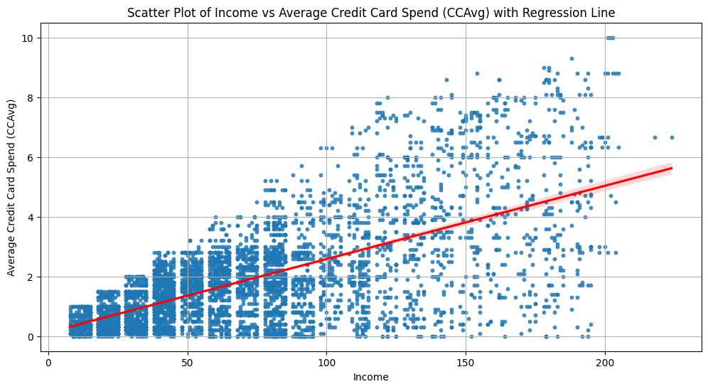

---
### Cell 60 [Type: Markdown]

**Input:**
```
Observations

The data indicates a positive relationship between income and average credit card spending, with spending levels generally increasing as income rises.

After approximately $100,000 in income, the growth in credit card spending begins to moderate, suggesting a diminishing rate of increase at higher income levels.

Overall, higher-income customers consistently demonstrate greater credit card spending compared to lower-income segments.
```

---
### Cell 61 [Type: Markdown]

**Input:**
```
Question 9. What is the relationship between Personal Loan vs Education?
```

---
### Cell 62 [Type: Code]

**Input:**
```
#create a count plot to visualize the relationship between CD_Account and Education.
plt.figure(figsize=(10, 6))
sns.countplot(x='Education', hue='CD_Account', data=personal_loan_df, palette="viridis")
plt.title('Count Plot of CD Account Ownership vs Education')
plt.xlabel('Education Level')
plt.ylabel('Count')
plt.legend(title='CD Account Ownership', loc='upper right', labels=['No', 'Yes'])
plt.grid(True)
plt.show()
```

**Plots/Images (1):**
- `plot_008.png` (png)
  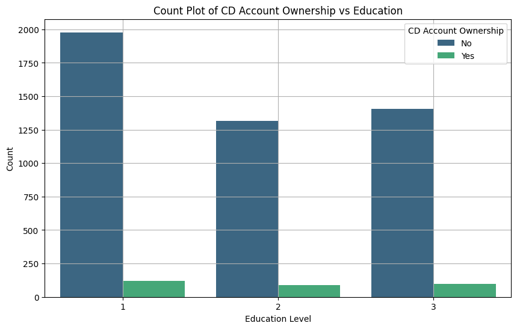

---
### Cell 63 [Type: Markdown]

**Input:**
```
Observations

There is no relationship between customers that own a CD Account vs their level of education.
```

---
### Cell 64 [Type: Markdown]

**Input:**
```
Question 10. What is the relationship between Online Banking Usage vs Top 10 ZIP Codes?¶
```

---
### Cell 65 [Type: Code]

**Input:**
```
#get the top 10 ZIP codes by count.
top_10_zip_codes = personal_loan_df['ZIPCode'].value_counts().nlargest(10).index

#filter the dataframe to include only the top 10 ZIP codes.
top_10_df = personal_loan_df[personal_loan_df['ZIPCode'].isin(top_10_zip_codes)]

#create a count plot to visualize the relationship between Online and the top 10 ZIP codes.
plt.figure(figsize=(14, 8))
sns.countplot(x='ZIPCode', hue='Online', data=top_10_df, palette="viridis")
plt.title('Count Plot of Online Banking Usage vs Top 10 ZIP Codes')
plt.xlabel('ZIP Code')
plt.ylabel('Count')
plt.legend(title='Online Banking Usage', loc='upper right', labels=['No', 'Yes'])
plt.grid(True)
plt.show()
```

**Plots/Images (1):**
- `plot_009.png` (png)
  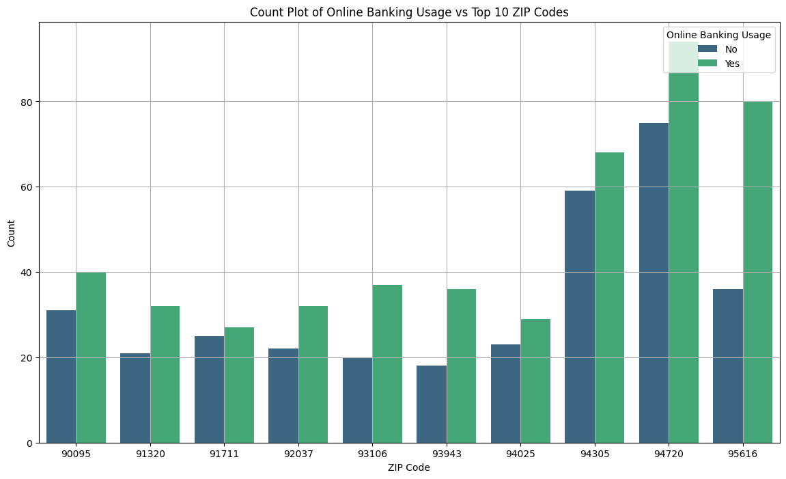

---
### Cell 66 [Type: Markdown]

**Input:**
```
Observations

ZIP codes 94720, 95616, and 94305 show the highest levels of online banking usage.

This concentration may suggest that these areas represent more affluent and highly educated populations who are more inclined to adopt and utilize digital banking services.
```

---
### Cell 67 [Type: Markdown]

**Input:**
```
Question 11. What is the relationship between Online Banking Usage vs Education?¶
```

---
### Cell 68 [Type: Code]

**Input:**
```
#create a count plot to visualize the relationship between Online and Education.
plt.figure(figsize=(10, 6))
sns.countplot(x='Education', hue='Online', data=personal_loan_df, palette="viridis")
plt.title('Count Plot of Online Banking Usage vs Education')
plt.xlabel('Education Level')
plt.ylabel('Count')
plt.legend(title='Online Banking Usage', loc='upper right', labels=['No', 'Yes'])
plt.grid(True)
plt.show()
```

**Plots/Images (1):**
- `plot_010.png` (png)
  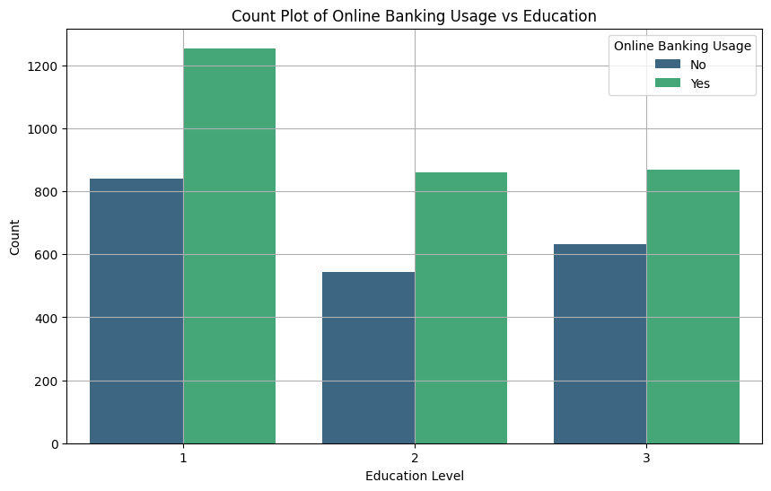

---
### Cell 69 [Type: Markdown]

**Input:**
```
Observations

The data demonstrates a positive association between education level and online banking adoption, with usage rates generally increasing alongside higher educational attainment.

Although undergraduates represent the largest individual segment of online banking users, the combined population of Graduate and Advanced/Professional customers surpasses the undergraduate group.

Increased education levels may contribute to stronger digital literacy, greater familiarity with technology, and higher confidence in utilizing online financial platforms.
```

---
### Cell 70 [Type: Markdown]

**Input:**
```
Question 12. What is the relationship between having a Average Credit Card spending vs Education?¶
```

---
### Cell 71 [Type: Code]

**Input:**
```
#create a box plot to visualize the relationship between CCAvg and Education.
plt.figure(figsize=(10, 6))
sns.boxplot(x='Education', y='CCAvg', data=personal_loan_df, palette="viridis")
plt.title('Box Plot of CCAvg vs Education')
plt.xlabel('Education Level')
plt.ylabel('CCAvg (Average Credit Card Spending)')
plt.grid(True)
plt.show()
```

**Plots/Images (1):**
- `plot_011.png` (png)
  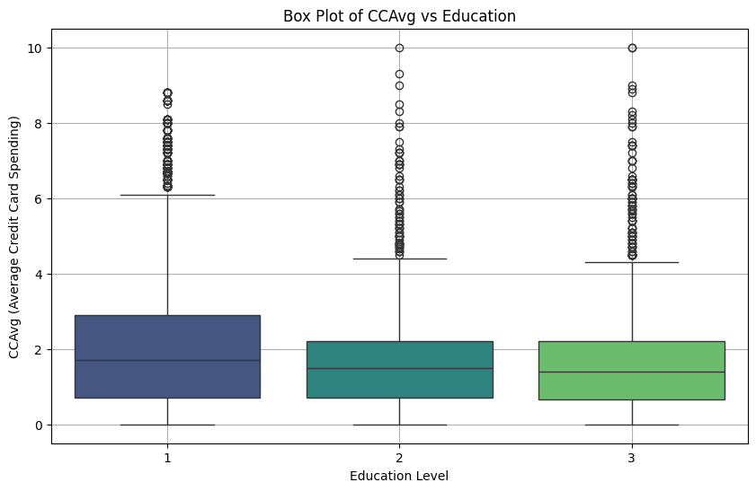

---
### Cell 72 [Type: Markdown]

**Input:**
```
Observations

Customers with Education Level 3 (Advanced/Professional) exhibit the highest median credit card spending.

Customers with Education Level 1 (Undergraduate) show the lowest median credit card spending among the groups.
```

---
### Cell 73 [Type: Markdown]

**Input:**
```
Data Preprocessing¶
```

---
### Cell 74 [Type: Markdown]

**Input:**
```
Missing value treatment
Feature engineering (if needed)
Outlier detection and treatment (if needed)
Preparing data for modeling
Any other preprocessing steps (if needed)
```

---
### Cell 75 [Type: Code]

**Input:**
```
#plot the correlation matrix as a heatmap.
plt.figure(figsize=(15, 7))
sns.heatmap(personal_loan_df.drop('AgeGroup', axis=1).corr(), annot=True, vmin=-1, vmax=1, fmt='.2f', cmap='coolwarm', linewidths=0.5)
plt.show()
```

**Plots/Images (1):**
- `plot_012.png` (png)
  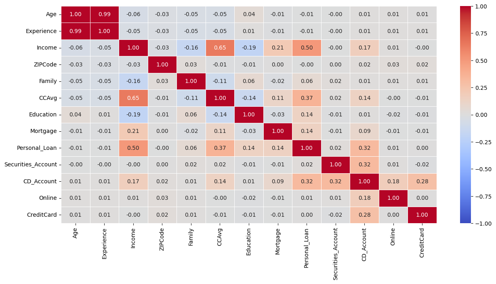

---
### Cell 76 [Type: Code]

**Input:**
```
#find anomalous values in the personal_loan_df DataFrame.
def detect_anomalous_values(df):
    anomalous_values = {}
    for column in df.select_dtypes(include=['int64', 'float64']).columns:
        Q1 = df[column].quantile(0.25)
        Q3 = df[column].quantile(0.75)
        IQR = Q3 - Q1
        lower_bound = Q1 - 1.5 * IQR
        upper_bound = Q3 + 1.5 * IQR
        outliers = df[(df[column] < lower_bound) | (df[column] > upper_bound)]
        if not outliers.empty:
            anomalous_values[column] = outliers[column].values
    return anomalous_values

#detect anomalous values in the personal_loan_df.
anomalous_values = detect_anomalous_values(personal_loan_df)

#print the anomalous values.
for column, values in anomalous_values.items():
    print(f"Anomalous values in column '{column}': {values}")
```

**Output:**
```
Anomalous values in column 'Income': [193 194 190 188 195 191 200 205 204 195 192 194 202 195 200 193 192 195
 191 188 191 190 190 194 195 192 190 195 191 192 195 192 193 190 198 201
 200 188 192 190 194 201 191 191 188 203 189 193 190 204 198 201 201 191
 191 195 190 188 190 195 195 205 198 190 191 191 195 194 194 202 191 199
 203 188 224 188 189 191 190 195 193 204 194 195 191 188 195 188 193 199
 188 199 194 201 195 218]
Anomalous values in column 'CCAvg': [ 8.9   8.1   5.7   8.    5.7   5.6   7.2   7.4   7.5   6.5   6.5   7.8
  7.9   6.8   7.4   7.5   7.9   6.2   5.5   6.9   7.5   7.3   6.1   6.33
  6.6   5.3   7.5   6.8   7.    6.6   6.3   7.5   5.7   8.3   5.5   6.9
  6.1   6.    8.    6.8   6.33  7.8   7.2   6.5   6.8   6.    7.2   8.6
  6.9   6.1   7.8   6.    7.6   7.4   6.1   7.    8.1   6.9   6.4   6.
  7.6   6.3   7.6  10.    6.    5.9   8.1   5.4   8.8   5.4   6.33  8.1
  8.8   5.7   7.6   7.3   7.    5.7   6.1   6.9   6.8   5.6   7.    6.5
  7.4   7.8   8.    7.    8.    6.8   6.3   6.3   8.8   8.1   6.33  5.4
  6.9   9.    6.    8.6   5.9   5.4   7.4   6.33  6.8   5.4   7.3   7.4
  6.7   6.9   7.    6.    7.    6.7   7.4   6.3   6.3   6.    6.    7.6
  6.67  6.33  6.5   6.5   7.4   7.2   5.3   5.7   8.6   8.3   5.8   7.8
  6.    5.4   7.4   8.1   6.67  6.    6.33  6.    6.5   5.67  7.3   8.5
  8.    6.7   7.3   8.    6.9  10.    6.5   6.5   5.67  7.3   8.    5.4
  5.7   6.9   7.    6.7   6.8   5.9  10.    7.5   5.6   6.67  6.1   7.5
  8.    6.1   6.7   8.8   7.4   7.3   6.7   6.5   6.1   6.    6.9   6.3
  7.8   6.67  6.    6.1   7.4   7.9   7.5   5.4   5.7   5.4   7.2   5.4
  8.    6.1   5.7   5.4   7.2   8.8   7.    6.5   7.9   6.3   6.9   7.6
  6.    5.8   8.2   5.7   7.3   6.67  8.1   7.5   7.8   5.9   6.7   7.
  6.5   8.6   8.8   7.    6.1   5.5   5.7   5.4   6.9   8.    7.5   6.1
  5.4   8.8   7.8   6.    5.33  7.2   8.6   6.7   8.    7.4   6.9   6.4
  6.    5.4   7.    6.5   5.6   5.6   5.8   5.4   6.    6.3   8.1   6.9
  6.3   8.1   5.7   6.    5.4   6.67  6.8   8.8   7.8   6.5   9.    7.2
  6.67  6.    9.3   5.6   7.5   7.6   5.5   6.5   6.3   6.7   7.2   6.5
  5.9   6.8   8.6   8.8   7.6   7.6   7.2   5.7   6.33  7.3   6.33  7.2
  7.4   6.    6.1   6.4   6.    8.1   5.6   6.3   7.3   8.5   5.3   6.
  5.4   6.5   6.3   8.6   6.67  6.2   6.6   8.    6.5   7.    6.33  7.2
  6.    6.6   6.    7.2   7.    6.    5.4   6.1   7.5   8.6   5.3   6.67]
Anomalous values in column 'Mortgage': [260 285 412 455 336 309 366 276 315 282 280 264 325 391 617 402 360 392
 419 270 466 290 458 547 470 304 271 378 314 485 300 272 275 327 322 282
 364 449 355 314 587 307 263 310 265 305 372 301 289 305 303 256 259 524
 287 333 357 361 301 366 294 329 442 394 327 475 297 437 428 333 366 257
 337 382 397 380 297 357 433 483 305 294 287 277 268 354 256 285 318 342
 266 455 341 421 359 565 319 394 267 601 567 352 284 256 334 268 389 342
 372 275 589 277 397 359 323 380 329 535 293 398 343 307 272 255 294 311
 446 262 266 323 319 422 315 289 310 299 428 505 309 400 301 267 422 307
 257 326 341 298 297 569 374 310 408 352 406 452 432 312 477 396 582 358
 380 467 331 303 565 295 282 264 327 262 635 352 385 437 328 522 301 276
 496 415 392 461 344 263 297 368 257 325 256 321 255 296 373 325 329 268
 292 383 280 358 354 275 408 442 315 427 271 364 429 431 286 508 272 416
 553 368 403 260 500 313 410 285 273 304 341 449 333 259 277 381 270 402
 292 400 330 345 294 428 253 255 258 351 427 312 294 353 322 308 278 342
 464 509 481 281 308 306 577 319 272 330 272 422 301 302 256 328 405 270
 264 571 307 293 581 550 328 283 400 307 323 263 612 590 313 260 541 342
 299 308 306]
Anomalous values in column 'Personal_Loan': [1 1 1 1 1 1 1 1 1 1 1 1 1 1 1 1 1 1 1 1 1 1 1 1 1 1 1 1 1 1 1 1 1 1 1 1 1
 1 1 1 1 1 1 1 1 1 1 1 1 1 1 1 1 1 1 1 1 1 1 1 1 1 1 1 1 1 1 1 1 1 1 1 1 1
 1 1 1 1 1 1 1 1 1 1 1 1 1 1 1 1 1 1 1 1 1 1 1 1 1 1 1 1 1 1 1 1 1 1 1 1 1
 1 1 1 1 1 1 1 1 1 1 1 1 1 1 1 1 1 1 1 1 1 1 1 1 1 1 1 1 1 1 1 1 1 1 1 1 1
 1 1 1 1 1 1 1 1 1 1 1 1 1 1 1 1 1 1 1 1 1 1 1 1 1 1 1 1 1 1 1 1 1 1 1 1 1
 1 1 1 1 1 1 1 1 1 1 1 1 1 1 1 1 1 1 1 1 1 1 1 1 1 1 1 1 1 1 1 1 1 1 1 1 1
 1 1 1 1 1 1 1 1 1 1 1 1 1 1 1 1 1 1 1 1 1 1 1 1 1 1 1 1 1 1 1 1 1 1 1 1 1
 1 1 1 1 1 1 1 1 1 1 1 1 1 1 1 1 1 1 1 1 1 1 1 1 1 1 1 1 1 1 1 1 1 1 1 1 1
 1 1 1 1 1 1 1 1 1 1 1 1 1 1 1 1 1 1 1 1 1 1 1 1 1 1 1 1 1 1 1 1 1 1 1 1 1
 1 1 1 1 1 1 1 1 1 1 1 1 1 1 1 1 1 1 1 1 1 1 1 1 1 1 1 1 1 1 1 1 1 1 1 1 1
 1 1 1 1 1 1 1 1 1 1 1 1 1 1 1 1 1 1 1 1 1 1 1 1 1 1 1 1 1 1 1 1 1 1 1 1 1
 1 1 1 1 1 1 1 1 1 1 1 1 1 1 1 1 1 1 1 1 1 1 1 1 1 1 1 1 1 1 1 1 1 1 1 1 1
 1 1 1 1 1 1 1 1 1 1 1 1 1 1 1 1 1 1 1 1 1 1 1 1 1 1 1 1 1 1 1 1 1 1 1 1]
Anomalous values in column 'Securities_Account': [1 1 1 1 1 1 1 1 1 1 1 1 1 1 1 1 1 1 1 1 1 1 1 1 1 1 1 1 1 1 1 1 1 1 1 1 1
 1 1 1 1 1 1 1 1 1 1 1 1 1 1 1 1 1 1 1 1 1 1 1 1 1 1 1 1 1 1 1 1 1 1 1 1 1
 1 1 1 1 1 1 1 1 1 1 1 1 1 1 1 1 1 1 1 1 1 1 1 1 1 1 1 1 1 1 1 1 1 1 1 1 1
 1 1 1 1 1 1 1 1 1 1 1 1 1 1 1 1 1 1 1 1 1 1 1 1 1 1 1 1 1 1 1 1 1 1 1 1 1
 1 1 1 1 1 1 1 1 1 1 1 1 1 1 1 1 1 1 1 1 1 1 1 1 1 1 1 1 1 1 1 1 1 1 1 1 1
 1 1 1 1 1 1 1 1 1 1 1 1 1 1 1 1 1 1 1 1 1 1 1 1 1 1 1 1 1 1 1 1 1 1 1 1 1
 1 1 1 1 1 1 1 1 1 1 1 1 1 1 1 1 1 1 1 1 1 1 1 1 1 1 1 1 1 1 1 1 1 1 1 1 1
 1 1 1 1 1 1 1 1 1 1 1 1 1 1 1 1 1 1 1 1 1 1 1 1 1 1 1 1 1 1 1 1 1 1 1 1 1
 1 1 1 1 1 1 1 1 1 1 1 1 1 1 1 1 1 1 1 1 1 1 1 1 1 1 1 1 1 1 1 1 1 1 1 1 1
 1 1 1 1 1 1 1 1 1 1 1 1 1 1 1 1 1 1 1 1 1 1 1 1 1 1 1 1 1 1 1 1 1 1 1 1 1
 1 1 1 1 1 1 1 1 1 1 1 1 1 1 1 1 1 1 1 1 1 1 1 1 1 1 1 1 1 1 1 1 1 1 1 1 1
 1 1 1 1 1 1 1 1 1 1 1 1 1 1 1 1 1 1 1 1 1 1 1 1 1 1 1 1 1 1 1 1 1 1 1 1 1
 1 1 1 1 1 1 1 1 1 1 1 1 1 1 1 1 1 1 1 1 1 1 1 1 1 1 1 1 1 1 1 1 1 1 1 1 1
 1 1 1 1 1 1 1 1 1 1 1 1 1 1 1 1 1 1 1 1 1 1 1 1 1 1 1 1 1 1 1 1 1 1 1 1 1
 1 1 1 1]
Anomalous values in column 'CD_Account': [1 1 1 1 1 1 1 1 1 1 1 1 1 1 1 1 1 1 1 1 1 1 1 1 1 1 1 1 1 1 1 1 1 1 1 1 1
 1 1 1 1 1 1 1 1 1 1 1 1 1 1 1 1 1 1 1 1 1 1 1 1 1 1 1 1 1 1 1 1 1 1 1 1 1
 1 1 1 1 1 1 1 1 1 1 1 1 1 1 1 1 1 1 1 1 1 1 1 1 1 1 1 1 1 1 1 1 1 1 1 1 1
 1 1 1 1 1 1 1 1 1 1 1 1 1 1 1 1 1 1 1 1 1 1 1 1 1 1 1 1 1 1 1 1 1 1 1 1 1
 1 1 1 1 1 1 1 1 1 1 1 1 1 1 1 1 1 1 1 1 1 1 1 1 1 1 1 1 1 1 1 1 1 1 1 1 1
 1 1 1 1 1 1 1 1 1 1 1 1 1 1 1 1 1 1 1 1 1 1 1 1 1 1 1 1 1 1 1 1 1 1 1 1 1
 1 1 1 1 1 1 1 1 1 1 1 1 1 1 1 1 1 1 1 1 1 1 1 1 1 1 1 1 1 1 1 1 1 1 1 1 1
 1 1 1 1 1 1 1 1 1 1 1 1 1 1 1 1 1 1 1 1 1 1 1 1 1 1 1 1 1 1 1 1 1 1 1 1 1
 1 1 1 1 1 1]
```

---
### Cell 77 [Type: Code]

**Input:**
```
#find the the outliers with Interquartile Range (IQR).
#select only numeric columns for quantile calculation
numeric_df = personal_loan_df.select_dtypes(include=['float64', 'int64'])

Q1 = numeric_df.quantile(0.25)
Q3 = numeric_df.quantile(0.75)

IQR = Q3 - Q1

lower = (
    Q1 - 1.5 * IQR
)
upper = Q3 + 1.5 * IQR
(
    (numeric_df < lower)
    | (numeric_df > upper)
).sum() / len(personal_loan_df) * 100
```

---
### Cell 78 [Type: Code]

**Input:**
```
#find number of unique ZIP codes.
print('Number of unique ZIP codes:', personal_loan_df['ZIPCode'].nunique())

#calculate the distribution of ZIP codes.
zipcode_distribution = personal_loan_df['ZIPCode'].value_counts()

#print first 20 ZIP codes.
print('Distribution of ZIP codes:')
print(zipcode_distribution.head(20))
```

**Output:**
```
Number of unique ZIP codes: 467
Distribution of ZIP codes:
ZIPCode
94720    169
94305    127
95616    116
90095     71
93106     57
93943     54
92037     54
91320     53
91711     52
94025     52
92093     51
90024     50
90245     50
91330     46
90089     46
92121     45
94304     45
94143     37
95051     34
94608     34
Name: count, dtype: int64
```

---
### Cell 79 [Type: Code]

**Input:**
```
#check for unique values in the dataset.
personal_loan_df.nunique()
```

---
### Cell 80 [Type: Code]

**Input:**
```
#find the unqiue numbers and count of unique values in the Experience column.
print('Unique values for Experience: ' + str(personal_loan_df['Experience'].unique()) + '\n')
print('Number of unique values in Experience:', personal_loan_df['Experience'].nunique())
```

**Output:**
```
Unique values for Experience: [ 1 19 15  9  8 13 27 24 10 39  5 23 32 41 30 14 18 21 28 31 11 16 20 35
  6 25  7 12 26 37 17  2 36 29  3 22 -1 34  0 38 40 33  4 -2 42 -3 43]

Number of unique values in Experience: 47
```

---
### Cell 81 [Type: Code]

**Input:**
```
#feature engineering

#change categorical features to 'category'.
category_cols = [
    'Education',
    'Personal_Loan',
    'Securities_Account',
    'CD_Account',
    'Online',
    'CreditCard',
    'ZIPCode',
]
personal_loan_df[category_cols] = personal_loan_df[category_cols].astype('category')

#check for changes in the data types.
categorical_columns = personal_loan_df.select_dtypes(include=['category']).columns.tolist()

#print the categorical columns.
print('Categorical columns:', categorical_columns)
```

**Output:**
```
Categorical columns: ['ZIPCode', 'Education', 'Personal_Loan', 'Securities_Account', 'CD_Account', 'Online', 'CreditCard', 'AgeGroup']
```

---
### Cell 82 [Type: Markdown]

**Input:**
```
Model Building¶
```

---
### Cell 83 [Type: Code]

**Input:**
```
#separate features (X) and target (y).
#drop 'AgeGroup' as it was created for EDA and not intended as a feature for the model.
X = personal_loan_df.drop(columns=['Personal_Loan', 'AgeGroup'])
y = personal_loan_df['Personal_Loan']

#split the data into training and testing sets
X_train, X_test, y_train, y_test = train_test_split(X, y, test_size=0.2, random_state=1, stratify=y)

print("X_train shape:", X_train.shape)
print("X_test shape:", X_test.shape)
print("y_train shape:", y_train.shape)
print("y_test shape:", y_test.shape)
```

**Output:**
```
X_train shape: (4000, 12)
X_test shape: (1000, 12)
y_train shape: (4000,)
y_test shape: (1000,)
```

---
### Cell 84 [Type: Code]

**Input:**
```
#encode categorical variables using one-hot encoding.
X_train_encoded = pd.get_dummies(X_train)
X_test_encoded = pd.get_dummies(X_test)

#ensure the training and test sets have the same columns after encoding.
X_train_encoded, X_test_encoded = X_train_encoded.align(X_test_encoded, join='left', axis=1, fill_value=0)

#initialize the DecisionTreeClassifier with the Gini impurity criterion and a fixed random state.
model = DecisionTreeClassifier(
    criterion="gini",
    random_state=1,
    # max_depth=5,            # Limit the maximum depth of the tree
    # min_samples_split=10,   # Minimum number of samples required to split an internal node
    # min_samples_leaf=5,     # Minimum number of samples required to be at a leaf node
    # max_leaf_nodes=20       # Maximum number of leaf nodes
)

#fit the model on the encoded training data.
model.fit(X_train_encoded, y_train)
```

**Output:**
```
DecisionTreeClassifier(random_state=1)
DecisionTreeClassifier(random_state=1)
```

---
### Cell 85 [Type: Code]

**Input:**
```
#predict on the training data.
y_train_pred = model.predict(X_train_encoded)

#calculate accuracy.
accuracy = accuracy_score(y_train, y_train_pred)
print(f'Accuracy: {accuracy:.2f}')

#calculate precision.
precision = precision_score(y_train, y_train_pred)
print(f'Precision: {precision:.2f}')

#calculate recall.
recall = recall_score(y_train, y_train_pred)
print(f'Recall: {recall:.2f}')

#calculate F1 score.
f1 = f1_score(y_train, y_train_pred)
print(f'F1 Score: {f1:.2f}')

#print classification report.
print('Classification Report:')
print(classification_report(y_train, y_train_pred))

#calculate confusion matrix.
conf_matrix = confusion_matrix(y_train, y_train_pred)

#plot confusion matrix.
plt.figure(figsize=(8, 6))
sns.heatmap(conf_matrix, annot=True, fmt='d', cmap='Blues', xticklabels=['Not Accepted', 'Accepted'], yticklabels=['Not Accepted', 'Accepted'])
plt.xlabel('Predicted')
plt.ylabel('Actual')
plt.title('Confusion Matrix')
plt.show()
```

**Output:**
```
Accuracy: 1.00
Precision: 1.00
Recall: 1.00
F1 Score: 1.00
Classification Report:
              precision    recall  f1-score   support

           0       1.00      1.00      1.00      3616
           1       1.00      1.00      1.00       384

    accuracy                           1.00      4000
   macro avg       1.00      1.00      1.00      4000
weighted avg       1.00      1.00      1.00      4000
```

---
### Cell 86 [Type: Code]

**Input:**
```
#function for model performance evaluation.

def model_performance_classification_sklearn(model, X, y):
    #predict the labels for the input features X using the provided model.
    y_pred = model.predict(X)

    #calculate the accuracy of the model.
    accuracy = accuracy_score(y, y_pred)

    #calculate the precision of the model.
    precision = precision_score(y, y_pred)

    #calculate the recall of the model.
    recall = recall_score(y, y_pred)

    #calculate the F1 score of the model.
    f1 = f1_score(y, y_pred)

    #return a dictionary containing the performance metrics.
    return {'Accuracy': accuracy, 'Precision': precision, 'Recall': recall, 'F1 Score': f1}
```

---
### Cell 87 [Type: Code]

**Input:**
```
#check performance on training data.
decision_tree_perf_train = model_performance_classification_sklearn(
    model, X_train_encoded, y_train
)
decision_tree_perf_train
```

**Output:**
```
{'Accuracy': 1.0, 'Precision': 1.0, 'Recall': 1.0, 'F1 Score': 1.0}
```

---
### Cell 88 [Type: Code]

**Input:**
```
#visualize the decision tree.
plt.figure(figsize=(20, 30))
out = tree.plot_tree(
    model, # type: ignore
    feature_names=list(X_train_encoded.columns),  # type: ignore
    filled=True,
    fontsize=9,
    node_ids=False,
    class_names=None,
)
#add arrows to the decision tree split if they are missing.
for o in out:
    arrow = o.arrow_patch
    if arrow is not None:
        arrow.set_edgecolor('black')
        arrow.set_linewidth(1)
plt.show()
```

**Plots/Images (1):**
- `plot_013.png` (png)
  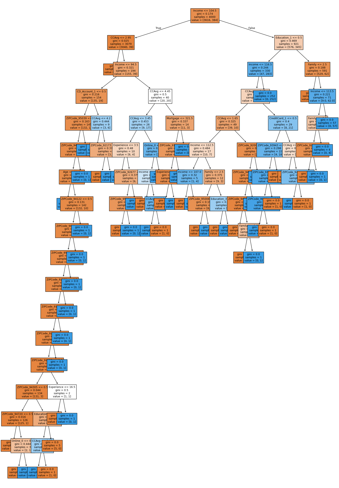

---
### Cell 89 [Type: Code]

**Input:**
```
#generate a text report showing the rules of the decision tree.
tree_rules = tree.export_text(model, feature_names=list(X_train_encoded.columns), show_weights=True) # type: ignore
print(tree_rules)
```

**Output:**
```
|--- Income <= 104.50
|   |--- CCAvg <= 2.95
|   |   |--- weights: [2885.00, 0.00] class: 0
|   |--- CCAvg >  2.95
|   |   |--- Income <= 94.50
|   |   |   |--- CD_Account_1 <= 0.50
|   |   |   |   |--- ZIPCode_95039 <= 0.50
|   |   |   |   |   |--- ZIPCode_94709 <= 0.50
|   |   |   |   |   |   |--- Age <= 26.50
|   |   |   |   |   |   |   |--- weights: [0.00, 1.00] class: 1
|   |   |   |   |   |   |--- Age >  26.50
|   |   |   |   |   |   |   |--- ZIPCode_94122 <= 0.50
|   |   |   |   |   |   |   |   |--- ZIPCode_90601 <= 0.50
|   |   |   |   |   |   |   |   |   |--- ZIPCode_95032 <= 0.50
|   |   |   |   |   |   |   |   |   |   |--- ZIPCode_92122 <= 0.50
|   |   |   |   |   |   |   |   |   |   |   |--- truncated branch of depth 7
|   |   |   |   |   |   |   |   |   |   |--- ZIPCode_92122 >  0.50
|   |   |   |   |   |   |   |   |   |   |   |--- weights: [0.00, 1.00] class: 1
|   |   |   |   |   |   |   |   |   |--- ZIPCode_95032 >  0.50
|   |   |   |   |   |   |   |   |   |   |--- weights: [0.00, 1.00] class: 1
|   |   |   |   |   |   |   |   |--- ZIPCode_90601 >  0.50
|   |   |   |   |   |   |   |   |   |--- weights: [0.00, 1.00] class: 1
|   |   |   |   |   |   |   |--- ZIPCode_94122 >  0.50
|   |   |   |   |   |   |   |   |--- weights: [0.00, 1.00] class: 1
|   |   |   |   |   |--- ZIPCode_94709 >  0.50
|   |   |   |   |   |   |--- weights: [0.00, 1.00] class: 1
|   |   |   |   |--- ZIPCode_95039 >  0.50
|   |   |   |   |   |--- weights: [0.00, 1.00] class: 1
|   |   |   |--- CD_Account_1 >  0.50
|   |   |   |   |--- CCAvg <= 4.20
|   |   |   |   |   |--- weights: [0.00, 5.00] class: 1
|   |   |   |   |--- CCAvg >  4.20
|   |   |   |   |   |--- ZIPCode_92173 <= 0.50
|   |   |   |   |   |   |--- weights: [3.00, 0.00] class: 0
|   |   |   |   |   |--- ZIPCode_92173 >  0.50
|   |   |   |   |   |   |--- weights: [0.00, 1.00] class: 1
|   |   |--- Income >  94.50
|   |   |   |--- CCAvg <= 4.45
|   |   |   |   |--- CCAvg <= 3.45
|   |   |   |   |   |--- Experience <= 3.50
|   |   |   |   |   |   |--- weights: [0.00, 2.00] class: 1
|   |   |   |   |   |--- Experience >  3.50
|   |   |   |   |   |   |--- ZIPCode_92677 <= 0.50
|   |   |   |   |   |   |   |--- ZIPCode_95814 <= 0.50
|   |   |   |   |   |   |   |   |--- weights: [6.00, 0.00] class: 0
|   |   |   |   |   |   |   |--- ZIPCode_95814 >  0.50
|   |   |   |   |   |   |   |   |--- weights: [0.00, 1.00] class: 1
|   |   |   |   |   |   |--- ZIPCode_92677 >  0.50
|   |   |   |   |   |   |   |--- weights: [0.00, 1.00] class: 1
|   |   |   |   |--- CCAvg >  3.45
|   |   |   |   |   |--- Online_0 <= 0.50
|   |   |   |   |   |   |--- Income <= 100.00
|   |   |   |   |   |   |   |--- weights: [2.00, 0.00] class: 0
|   |   |   |   |   |   |--- Income >  100.00
|   |   |   |   |   |   |   |--- CCAvg <= 4.30
|   |   |   |   |   |   |   |   |--- weights: [0.00, 4.00] class: 1
|   |   |   |   |   |   |   |--- CCAvg >  4.30
|   |   |   |   |   |   |   |   |--- weights: [1.00, 0.00] class: 0
|   |   |   |   |   |--- Online_0 >  0.50
|   |   |   |   |   |   |--- weights: [0.00, 9.00] class: 1
|   |   |   |--- CCAvg >  4.45
|   |   |   |   |--- Mortgage <= 321.50
|   |   |   |   |   |--- ZIPCode_91380 <= 0.50
|   |   |   |   |   |   |--- Experience <= 31.00
|   |   |   |   |   |   |   |--- weights: [11.00, 0.00] class: 0
|   |   |   |   |   |   |--- Experience >  31.00
|   |   |   |   |   |   |   |--- weights: [0.00, 1.00] class: 1
|   |   |   |   |   |--- ZIPCode_91380 >  0.50
|   |   |   |   |   |   |--- weights: [0.00, 1.00] class: 1
|   |   |   |   |--- Mortgage >  321.50
|   |   |   |   |   |--- weights: [0.00, 1.00] class: 1
|--- Income >  104.50
|   |--- Education_1 <= 0.50
|   |   |--- Income <= 116.50
|   |   |   |--- CCAvg <= 2.45
|   |   |   |   |--- CCAvg <= 1.65
|   |   |   |   |   |--- Income <= 112.50
|   |   |   |   |   |   |--- Income <= 107.00
|   |   |   |   |   |   |   |--- weights: [1.00, 0.00] class: 0
|   |   |   |   |   |   |--- Income >  107.00
|   |   |   |   |   |   |   |--- weights: [0.00, 4.00] class: 1
|   |   |   |   |   |--- Income >  112.50
|   |   |   |   |   |   |--- Family <= 2.50
|   |   |   |   |   |   |   |--- ZIPCode_95008 <= 0.50
|   |   |   |   |   |   |   |   |--- weights: [8.00, 0.00] class: 0
|   |   |   |   |   |   |   |--- ZIPCode_95008 >  0.50
|   |   |   |   |   |   |   |   |--- weights: [0.00, 1.00] class: 1
|   |   |   |   |   |   |--- Family >  2.50
|   |   |   |   |   |   |   |--- Education_3 <= 0.50
|   |   |   |   |   |   |   |   |--- weights: [1.00, 0.00] class: 0
|   |   |   |   |   |   |   |--- Education_3 >  0.50
|   |   |   |   |   |   |   |   |--- weights: [0.00, 2.00] class: 1
|   |   |   |   |--- CCAvg >  1.65
|   |   |   |   |   |--- ZIPCode_92007 <= 0.50
|   |   |   |   |   |   |--- ZIPCode_94110 <= 0.50
|   |   |   |   |   |   |   |--- ZIPCode_94720 <= 0.50
|   |   |   |   |   |   |   |   |--- weights: [27.00, 0.00] class: 0
|   |   |   |   |   |   |   |--- ZIPCode_94720 >  0.50
|   |   |   |   |   |   |   |   |--- Family <= 3.50
|   |   |   |   |   |   |   |   |   |--- weights: [2.00, 0.00] class: 0
|   |   |   |   |   |   |   |   |--- Family >  3.50
|   |   |   |   |   |   |   |   |   |--- weights: [0.00, 1.00] class: 1
|   |   |   |   |   |   |--- ZIPCode_94110 >  0.50
|   |   |   |   |   |   |   |--- weights: [0.00, 1.00] class: 1
|   |   |   |   |   |--- ZIPCode_92007 >  0.50
|   |   |   |   |   |   |--- weights: [0.00, 1.00] class: 1
|   |   |   |--- CCAvg >  2.45
|   |   |   |   |--- CreditCard_1 <= 0.50
|   |   |   |   |   |--- ZIPCode_93943 <= 0.50
|   |   |   |   |   |   |--- ZIPCode_93106 <= 0.50
|   |   |   |   |   |   |   |--- ZIPCode_90064 <= 0.50
|   |   |   |   |   |   |   |   |--- weights: [0.00, 18.00] class: 1
|   |   |   |   |   |   |   |--- ZIPCode_90064 >  0.50
|   |   |   |   |   |   |   |   |--- weights: [1.00, 0.00] class: 0
|   |   |   |   |   |   |--- ZIPCode_93106 >  0.50
|   |   |   |   |   |   |   |--- weights: [1.00, 0.00] class: 0
|   |   |   |   |   |--- ZIPCode_93943 >  0.50
|   |   |   |   |   |   |--- weights: [2.00, 0.00] class: 0
|   |   |   |   |--- CreditCard_1 >  0.50
|   |   |   |   |   |--- CCAvg <= 3.60
|   |   |   |   |   |   |--- weights: [3.00, 0.00] class: 0
|   |   |   |   |   |--- CCAvg >  3.60
|   |   |   |   |   |   |--- ZIPCode_92120 <= 0.50
|   |   |   |   |   |   |   |--- weights: [0.00, 3.00] class: 1
|   |   |   |   |   |   |--- ZIPCode_92120 >  0.50
|   |   |   |   |   |   |   |--- weights: [1.00, 0.00] class: 0
|   |   |--- Income >  116.50
|   |   |   |--- weights: [0.00, 252.00] class: 1
|   |--- Education_1 >  0.50
|   |   |--- Family <= 2.50
|   |   |   |--- weights: [520.00, 0.00] class: 0
|   |   |--- Family >  2.50
|   |   |   |--- Income <= 113.50
|   |   |   |   |--- Family <= 3.50
|   |   |   |   |   |--- ZIPCode_92709 <= 0.50
|   |   |   |   |   |   |--- weights: [9.00, 0.00] class: 0
|   |   |   |   |   |--- ZIPCode_92709 >  0.50
|   |   |   |   |   |   |--- weights: [0.00, 1.00] class: 1
|   |   |   |   |--- Family >  3.50
|   |   |   |   |   |--- weights: [0.00, 4.00] class: 1
|   |   |   |--- Income >  113.50
|   |   |   |   |--- weights: [0.00, 57.00] class: 1
```

---
### Cell 90 [Type: Code]

**Input:**
```
#assign the feature importances to a variable.
importances = model.feature_importances_

#sort indices in descending order.
indices = np.argsort(importances)[::-1]

#create a DataFrame for feature importances.
feature_importances_df = pd.DataFrame({
    'Feature': [list(X_train_encoded.columns)[i] for i in indices],  # type: ignore
    'Importance': importances[indices]
})

#print the DataFrame.
print(feature_importances_df)
```

**Output:**
```
Feature  Importance
0           Income    0.364185
1      Education_1    0.347982
2           Family    0.147815
3            CCAvg    0.057276
4     CD_Account_1    0.008128
..             ...         ...
479  ZIPCode_94404    0.000000
480  ZIPCode_94501    0.000000
481  ZIPCode_94507    0.000000
482  ZIPCode_94509    0.000000
483  ZIPCode_94131    0.000000

[484 rows x 2 columns]
```

---
### Cell 91 [Type: Code]

**Input:**
```
#check model performance on the test data.

#predict on the test data.
y_test_pred = model.predict(X_test_encoded) # type: ignore

#calculate accuracy.
accuracy = accuracy_score(y_test, y_test_pred)
print(f'Accuracy: {accuracy:.2f}')

#calculate precision.
precision = precision_score(y_test, y_test_pred)
print(f'Precision: {precision:.2f}')

#calculate recall.
recall = recall_score(y_test, y_test_pred)
print(f'Recall: {recall:.2f}')

#calculate F1 score.
f1 = f1_score(y_test, y_test_pred)
print(f'F1 Score: {f1:.2f}')

#print classification report.
print('Classification Report:')
print(classification_report(y_test, y_test_pred))

#calculate confusion matrix
conf_matrix = confusion_matrix(y_test, y_test_pred)

#plot confusion matrix
plt.figure(figsize=(8, 6))
sns.heatmap(conf_matrix, annot=True, fmt='d', cmap='Blues', xticklabels=['Not Accepted', 'Accepted'], yticklabels=['Not Accepted', 'Accepted'])
plt.xlabel('Predicted')
plt.ylabel('Actual')
plt.title('Confusion Matrix')
plt.show()
```

**Output:**
```
Accuracy: 0.97
Precision: 0.86
Recall: 0.86
F1 Score: 0.86
Classification Report:
              precision    recall  f1-score   support

           0       0.99      0.99      0.99       904
           1       0.86      0.86      0.86        96

    accuracy                           0.97      1000
   macro avg       0.93      0.93      0.93      1000
weighted avg       0.97      0.97      0.97      1000
```

---
### Cell 92 [Type: Code]

**Input:**
```
#check performance on the test data.
decision_tree_perf_test = model_performance_classification_sklearn(model, X_test_encoded, y_test) # type: ignore
decision_tree_perf_test
```

**Output:**
```
{'Accuracy': 0.974,
 'Precision': 0.8645833333333334,
 'Recall': 0.8645833333333334,
 'F1 Score': 0.8645833333333334}
```

---
### Cell 93 [Type: Markdown]

**Input:**
```
Pre-Pruning
```

---
### Cell 94 [Type: Code]

**Input:**
```
#choose the type of classifier.
estimator = DecisionTreeClassifier(random_state=1)

#hyperparameter grid.
parameters = {
    "max_depth": np.arange(6, 15),
    "min_samples_leaf": [1, 2, 5, 7, 10],
    "max_leaf_nodes": [2, 3, 5, 10],
}

#type of scoring used to compare parameter combinations.
acc_scorer = make_scorer(recall_score)

#run the grid search.
grid_obj = GridSearchCV(estimator, parameters, scoring=acc_scorer, cv=5)
grid_obj = grid_obj.fit(X_train_encoded, y_train) # type: ignore

#set the clf to the best combination of parameters.
estimator = grid_obj.best_estimator_

#fit the best algorithm to the data.
estimator.fit(X_train_encoded, y_train) # type: ignore
```

**Output:**
```
DecisionTreeClassifier(max_depth=np.int64(6), max_leaf_nodes=10,
                       min_samples_leaf=10, random_state=1)
DecisionTreeClassifier(max_depth=np.int64(6), max_leaf_nodes=10,
                       min_samples_leaf=10, random_state=1)
```

---
### Cell 95 [Type: Code]

**Input:**
```
#check model performance on the test data.

#predict on the test data.
y_test_pred = model.predict(X_train_encoded) # type: ignore

#calculate accuracy.
accuracy = accuracy_score(y_train, y_train_pred) # type: ignore
print(f'Accuracy: {accuracy:.2f}')

#calculate precision.
precision = precision_score(y_train, y_train_pred) # type: ignore
print(f'Precision: {precision:.2f}')

#calculate recall.
recall = recall_score(y_train, y_train_pred) # type: ignore
print(f'Recall: {recall:.2f}')

#calculate F1 score.
f1 = f1_score(y_train, y_train_pred) # type: ignore
print(f'F1 Score: {f1:.2f}')

#print classification report.
print('Classification Report:')
print(classification_report(y_train, y_train_pred)) # type: ignore

#calculate confusion matrix.
conf_matrix = confusion_matrix(y_train, y_train_pred) # type: ignore

#plot confusion matrix.
plt.figure(figsize=(8, 6))
sns.heatmap(conf_matrix, annot=True, fmt='d', cmap='Blues', xticklabels=['Not Accepted', 'Accepted'], yticklabels=['Not Accepted', 'Accepted'])
plt.xlabel('Predicted')
plt.ylabel('Actual')
plt.title('Confusion Matrix')
plt.show()
```

**Output:**
```
Accuracy: 1.00
Precision: 1.00
Recall: 1.00
F1 Score: 1.00
Classification Report:
              precision    recall  f1-score   support

           0       1.00      1.00      1.00      3616
           1       1.00      1.00      1.00       384

    accuracy                           1.00      4000
   macro avg       1.00      1.00      1.00      4000
weighted avg       1.00      1.00      1.00      4000
```

---
### Cell 96 [Type: Code]

**Input:**
```
#check performance on the tuned data.
decision_tree_tune_perf_train = model_performance_classification_sklearn(estimator, X_train_encoded, y_train) # type: ignore
decision_tree_tune_perf_train
```

**Output:**
```
{'Accuracy': 0.9865,
 'Precision': 0.9532967032967034,
 'Recall': 0.9036458333333334,
 'F1 Score': 0.9278074866310161}
```

---
### Cell 97 [Type: Code]

**Input:**
```
#visualize the decision tree.
plt.figure(figsize=(20, 30))
out = tree.plot_tree(
    estimator,
    feature_names=list(X_train_encoded.columns), # type: ignore
    filled=True,
    fontsize=9,
    node_ids=False,
    class_names=None,
)
#add arrows to the decision tree split if they are missing.
for o in out:
    arrow = o.arrow_patch
    if arrow is not None:
        arrow.set_edgecolor("black")
        arrow.set_linewidth(1)
plt.show()
```

**Plots/Images (1):**
- `plot_014.png` (png)
  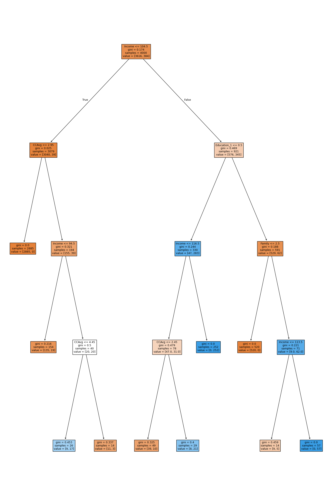

---
### Cell 98 [Type: Code]

**Input:**
```
#predict on the training data.
y_train_pred = estimator.predict(X_train_encoded) # type: ignore

#calculate accuracy.
accuracy = accuracy_score(y_train, y_train_pred)
print(f'Accuracy: {accuracy:.2f}')

#calculate precision.
precision = precision_score(y_train, y_train_pred)
print(f'Precision: {precision:.2f}')

#calculate recall.
recall = recall_score(y_train, y_train_pred)
print(f'Recall: {recall:.2f}')

#calculate F1 score.
f1 = f1_score(y_train, y_train_pred)
print(f'F1 Score: {f1:.2f}')

#print classification report.
print('Classification Report:')
print(classification_report(y_train, y_train_pred))

#calculate confusion matrix.
conf_matrix = confusion_matrix(y_train, y_train_pred)

#plot confusion matrix.
plt.figure(figsize=(8, 6))
sns.heatmap(conf_matrix, annot=True, fmt='d', cmap='Blues', xticklabels=['Not Accepted', 'Accepted'], yticklabels=['Not Accepted', 'Accepted'])
plt.xlabel('Predicted')
plt.ylabel('Actual')
plt.title('Confusion Matrix')
plt.show()
```

**Output:**
```
Accuracy: 0.99
Precision: 0.95
Recall: 0.90
F1 Score: 0.93
Classification Report:
              precision    recall  f1-score   support

           0       0.99      1.00      0.99      3616
           1       0.95      0.90      0.93       384

    accuracy                           0.99      4000
   macro avg       0.97      0.95      0.96      4000
weighted avg       0.99      0.99      0.99      4000
```

---
### Cell 99 [Type: Code]

**Input:**
```
#generate a text report showing the rules of the decision tree.
tree_rules = tree.export_text(estimator, feature_names=list(X_train_encoded.columns), show_weights=True) # type: ignore
print(tree_rules)
```

**Output:**
```
|--- Income <= 104.50
|   |--- CCAvg <= 2.95
|   |   |--- weights: [2885.00, 0.00] class: 0
|   |--- CCAvg >  2.95
|   |   |--- Income <= 94.50
|   |   |   |--- weights: [135.00, 19.00] class: 0
|   |   |--- Income >  94.50
|   |   |   |--- CCAvg <= 4.45
|   |   |   |   |--- weights: [9.00, 17.00] class: 1
|   |   |   |--- CCAvg >  4.45
|   |   |   |   |--- weights: [11.00, 3.00] class: 0
|--- Income >  104.50
|   |--- Education_1 <= 0.50
|   |   |--- Income <= 116.50
|   |   |   |--- CCAvg <= 2.45
|   |   |   |   |--- weights: [39.00, 10.00] class: 0
|   |   |   |--- CCAvg >  2.45
|   |   |   |   |--- weights: [8.00, 21.00] class: 1
|   |   |--- Income >  116.50
|   |   |   |--- weights: [0.00, 252.00] class: 1
|   |--- Education_1 >  0.50
|   |   |--- Family <= 2.50
|   |   |   |--- weights: [520.00, 0.00] class: 0
|   |   |--- Family >  2.50
|   |   |   |--- Income <= 113.50
|   |   |   |   |--- weights: [9.00, 5.00] class: 0
|   |   |   |--- Income >  113.50
|   |   |   |   |--- weights: [0.00, 57.00] class: 1
```

---
### Cell 100 [Type: Code]

**Input:**
```
#check performance on the test data.
decision_tree_tune_perf_test = model_performance_classification_sklearn(model, X_test_encoded, y_test)
decision_tree_tune_perf_test
```

**Output:**
```
{'Accuracy': 0.974,
 'Precision': 0.8645833333333334,
 'Recall': 0.8645833333333334,
 'F1 Score': 0.8645833333333334}
```

---
### Cell 101 [Type: Code]

**Input:**
```
#compute the pruning path for the decision tree using minimal cost-complexity pruning.
clf = DecisionTreeClassifier(random_state=1)
path = clf.cost_complexity_pruning_path(X_train_encoded, y_train) # type: ignore
ccp_alphas, impurities = path.ccp_alphas, path.impurities

#create a DataFrame and sort by ccp_alphas in descending order.
pruning_path_df = pd.DataFrame(path)
pruning_path_df_sorted = pruning_path_df.sort_values(by='ccp_alphas', ascending=False)

#show sorted pruning path values.
pruning_path_df_sorted
```

---
### Cell 102 [Type: Code]

**Input:**
```
#create a figure and an axis object with a specified size.
fig, ax = plt.subplots(figsize=(10, 5))

#plot the relationship between effective alpha and total impurity of leaves
# Use markers "o" and draw style "steps-post" for the plot.
ax.plot(ccp_alphas[:-1], impurities[:-1], marker="o", drawstyle="steps-post")

#set the label for the x-axis.
ax.set_xlabel("effective alpha")

#set the label for the y-axis.
ax.set_ylabel("total impurity of leaves")

#set the title of the plot.
ax.set_title("Total Impurity vs effective alpha for training set")

#display the plot.
plt.show()
```

**Plots/Images (1):**
- `plot_015.png` (png)
  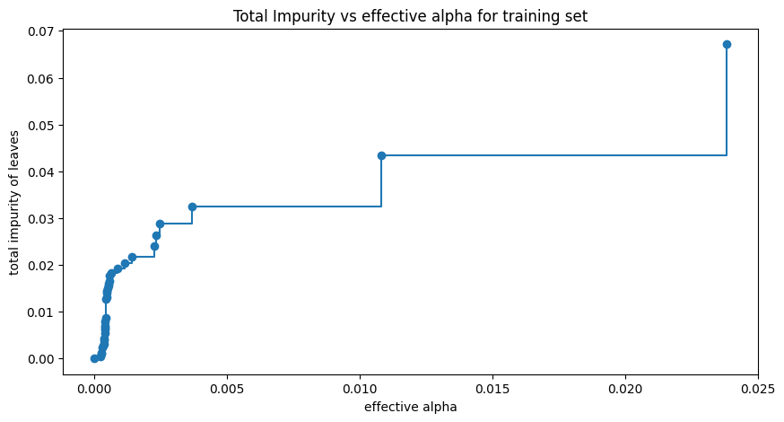

---
### Cell 103 [Type: Code]

**Input:**
```
#initialize an empty list to store the decision tree classifiers.
clfs = []

#iterate over the list of ccp_alpha values.
for ccp_alpha in ccp_alphas:
    #initialize a DecisionTreeClassifier with the current ccp_alpha value
    #and a fixed random state.
    clf = DecisionTreeClassifier(random_state=1, ccp_alpha=ccp_alpha)

    #fit the decision tree classifier on the training data.
    clf.fit(X_train_encoded, y_train) # type: ignore

    #append the fitted classifier to the list.
    clfs.append(clf)

#print the number of nodes in the last tree and the corresponding ccp_alpha value.
print(
    "Number of nodes in the last tree is: {} with ccp_alpha: {}".format(
        clfs[-1].tree_.node_count, ccp_alphas[-1]
    )
)
```

**Output:**
```
Number of nodes in the last tree is: 1 with ccp_alpha: 0.053207040267020625
```

---
### Cell 104 [Type: Code]

**Input:**
```
#remove the last element from the list of classifiers and ccp_alphas.
clfs = clfs[:-1]
ccp_alphas = ccp_alphas[:-1]

#calculate the number of nodes for each classifier.
node_counts = [clf.tree_.node_count for clf in clfs]

#calculate the depth of each classifier.
depth = [clf.tree_.max_depth for clf in clfs]

#create a figure with two subplots, arranged vertically, with a specified size.
fig, ax = plt.subplots(2, 1, figsize=(10, 7))

#plot the number of nodes vs alpha on the first subplot.
ax[0].plot(ccp_alphas, node_counts, marker="o", drawstyle="steps-post")
ax[0].set_xlabel("alpha")
ax[0].set_ylabel("number of nodes")
ax[0].set_title("Number of nodes vs alpha")

#plot the depth of the tree vs alpha on the second subplot.
ax[1].plot(ccp_alphas, depth, marker="o", drawstyle="steps-post")
ax[1].set_xlabel("alpha")
ax[1].set_ylabel("depth of tree")
ax[1].set_title("Depth vs alpha")

#adjust the layout to prevent overlap.
fig.tight_layout()
```

**Plots/Images (1):**
- `plot_016.png` (png)
  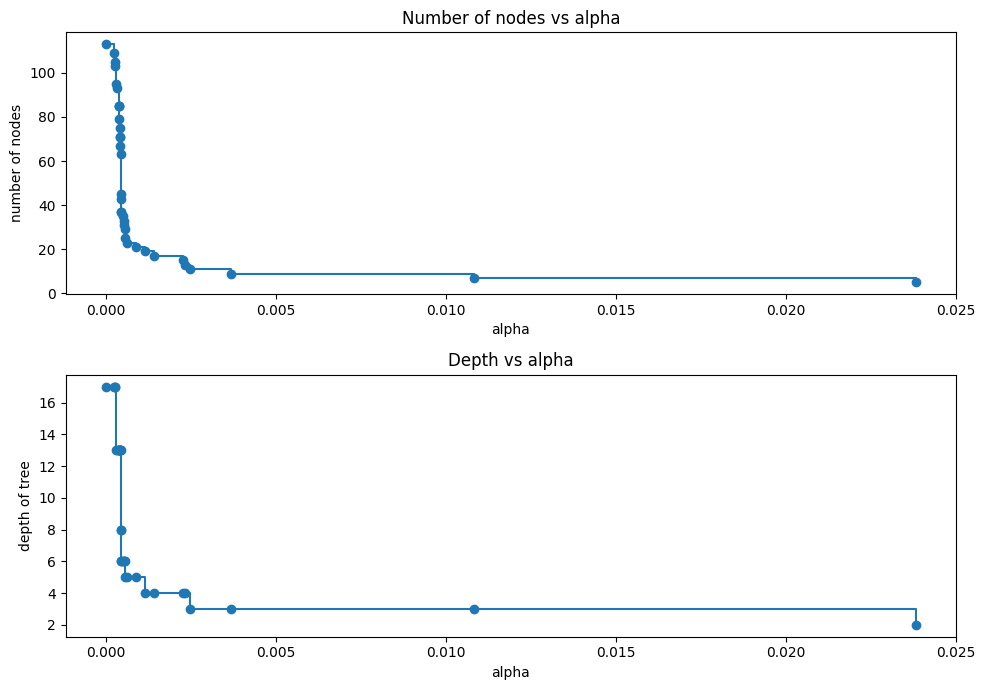

---
### Cell 105 [Type: Code]

**Input:**
```
#initialize lists to store training and testing accuracies.
train_scores = []
test_scores = []

#iterate through each classifier in the list of pruned trees.
for clf in clfs:
    #calculate the accuracy on the training data and append it to the list.
    train_scores.append(clf.score(X_train_encoded, y_train))
    #calculate the accuracy on the testing data and append it to the list.
    test_scores.append(clf.score(X_test_encoded, y_test))

#plot the training and testing scores against ccp_alphas.
fig, ax = plt.subplots(figsize=(10, 5))
ax.set_xlabel("alpha")
ax.set_ylabel("accuracy")
ax.set_title("Accuracy vs alpha for training and testing sets")
ax.plot(ccp_alphas, train_scores, marker='o', label="train", drawstyle="steps-post")
ax.plot(ccp_alphas, test_scores, marker='o', label="test", drawstyle="steps-post")
ax.legend()
plt.show()
```

**Plots/Images (1):**
- `plot_017.png` (png)
  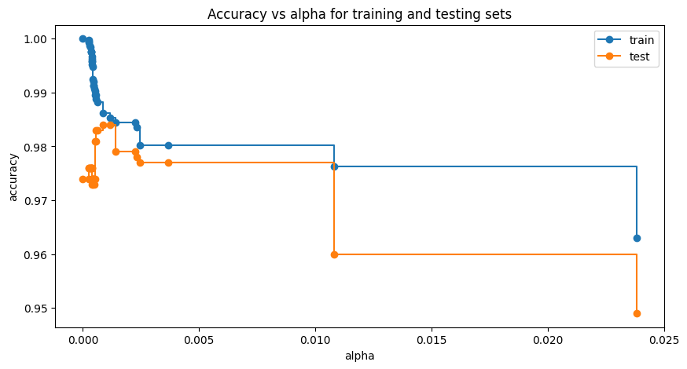

---
### Cell 106 [Type: Code]

**Input:**
```
#remove the last element from the list of classifiers and ccp_alphas.
clfs = clfs[:-1]
ccp_alphas = ccp_alphas[:-1]

#calculate the number of nodes for each classifier.
node_counts = [clf.tree_.node_count for clf in clfs]

#calculate the depth of each classifier.
depth = [clf.tree_.max_depth for clf in clfs]

#create a figure with two subplots, arranged vertically, with a specified size.
fig, ax = plt.subplots(2, 1, figsize=(10, 7))

#plot the number of nodes vs alpha on the first subplot.
ax[0].plot(ccp_alphas, node_counts, marker="o", drawstyle="steps-post")
ax[0].set_xlabel("alpha")
ax[0].set_ylabel("number of nodes")
ax[0].set_title("Number of nodes vs alpha")

#plot the depth of the tree vs alpha on the second subplot.
ax[1].plot(ccp_alphas, depth, marker="o", drawstyle="steps-post")
ax[1].set_xlabel("alpha")
ax[1].set_ylabel("depth of tree")
ax[1].set_title("Depth vs alpha")

#adjust the layout to prevent overlap.
fig.tight_layout()
```

**Plots/Images (1):**
- `plot_018.png` (png)
  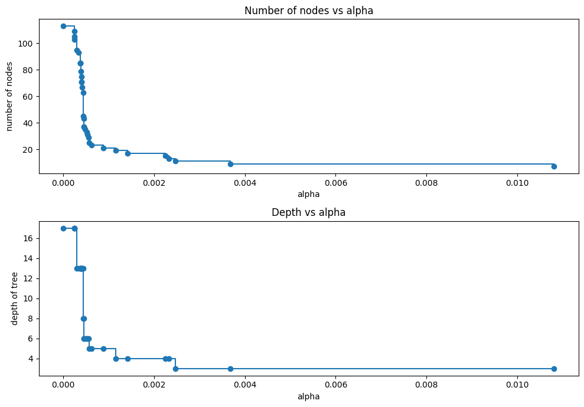

---
### Cell 107 [Type: Code]

**Input:**
```
#initialize an empty list to store recall scores for the training set.
recall_train = []

#iterate over the list of classifiers.
for clf in clfs:
    #predict the labels for the training set using the current classifier.
    pred_train = clf.predict(X_train_encoded)

    #calculate the recall score for the training set.
    values_train = recall_score(y_train, pred_train)

    #append the recall score to the recall_train list.
    recall_train.append(values_train)

#initialize an empty list to store recall scores for the test set.
recall_test = []

#iterate over the list of classifiers.
for clf in clfs:
    #predict the labels for the test set using the current classifier.
    pred_test = clf.predict(X_test_encoded) # type: ignore

    #calculate the recall score for the test set.
    values_test = recall_score(y_test, pred_test)

    #append the recall score to the recall_test list.
    recall_test.append(values_test)
```

---
### Cell 108 [Type: Code]

**Input:**
```
#create a figure and an axis object with a specified size.
fig, ax = plt.subplots(figsize=(15, 5))

#set the label for the x-axis.
ax.set_xlabel("alpha")

#set the label for the y-axis.
ax.set_ylabel("Recall")

#set the title of the plot.
ax.set_title("Recall vs alpha for training and testing sets")

#plot the recall scores for the training set vs alpha.
#use markers "o" and draw style "steps-post" for the plot.
ax.plot(ccp_alphas, recall_train, marker="o", label="train", drawstyle="steps-post")

#plot the recall scores for the test set vs alpha.
#use markers "o" and draw style "steps-post" for the plot.
ax.plot(ccp_alphas, recall_test, marker="o", label="test", drawstyle="steps-post")

#add a legend to the plot.
ax.legend()

#display the plot.
plt.show()
```

**Plots/Images (1):**
- `plot_019.png` (png)
  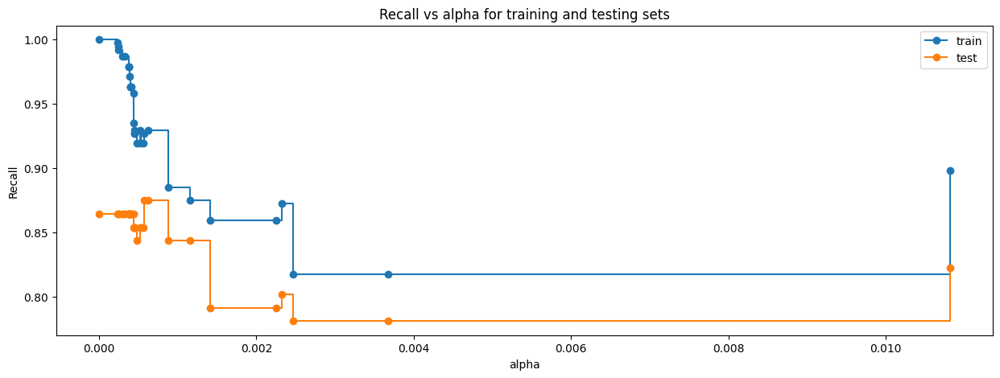

---
### Cell 109 [Type: Code]

**Input:**
```
#find the index of the classifier with the highest recall score on the test set.
index_best_model = np.argmax(recall_test)

#select the classifier corresponding to the best recall score.
best_model = clfs[index_best_model]

#print the details of the best model.
print(best_model)
```

**Output:**
```
DecisionTreeClassifier(ccp_alpha=np.float64(0.0005697044334975368),
                       random_state=1)
```

---
### Cell 110 [Type: Markdown]

**Input:**
```
Post-Pruning
```

---
### Cell 111 [Type: Code]

**Input:**
```
#initialize the DecisionTreeClassifier with the last ccp_alpha value from the pruning path,
#set class weights to handle class imbalance, and set a random state for reproducibility.
estimator_2 = DecisionTreeClassifier(
    ccp_alpha=ccp_alphas[-1],  # Use the last ccp_alpha value.
    class_weight={0: 0.15, 1: 0.85},  # Set class weights.
    random_state=1  # Set random state for reproducibility.
)

#fit the classifier on the training data.
estimator_2.fit(X_train_encoded, y_train) # type: ignore
```

**Output:**
```
DecisionTreeClassifier(ccp_alpha=np.float64(0.010813286713286706),
                       class_weight={0: 0.15, 1: 0.85}, random_state=1)
DecisionTreeClassifier(ccp_alpha=np.float64(0.010813286713286706),
                       class_weight={0: 0.15, 1: 0.85}, random_state=1)
```

---
### Cell 112 [Type: Code]

**Input:**
```
#visualize the decision tree.
plt.figure(figsize=(10, 10))
out = tree.plot_tree(
    estimator_2,
    feature_names=list(X_train_encoded.columns), # type: ignore
    filled=True,
    fontsize=9,
    node_ids=False,
    class_names=None,
)
#add arrows to the decision tree split if they are missing.
for o in out:
    arrow = o.arrow_patch
    if arrow is not None:
        arrow.set_edgecolor('black')
        arrow.set_linewidth(1)
plt.show()
```

**Plots/Images (1):**
- `plot_020.png` (png)
  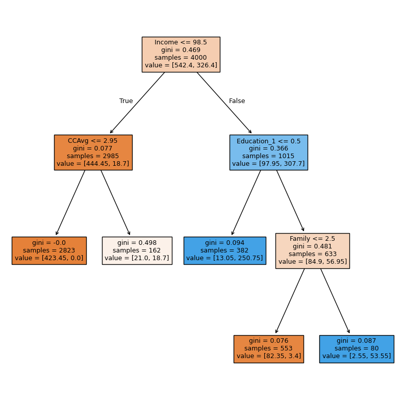

---
### Cell 113 [Type: Code]

**Input:**
```
#generate a text report showing the rules of the decision tree.
tree_rules = tree.export_text(estimator_2, feature_names=list(X_train_encoded.columns),show_weights=True) # type: ignore
print(tree_rules)
```

**Output:**
```
|--- Income <= 98.50
|   |--- CCAvg <= 2.95
|   |   |--- weights: [423.45, 0.00] class: 0
|   |--- CCAvg >  2.95
|   |   |--- weights: [21.00, 18.70] class: 0
|--- Income >  98.50
|   |--- Education_1 <= 0.50
|   |   |--- weights: [13.05, 250.75] class: 1
|   |--- Education_1 >  0.50
|   |   |--- Family <= 2.50
|   |   |   |--- weights: [82.35, 3.40] class: 0
|   |   |--- Family >  2.50
|   |   |   |--- weights: [2.55, 53.55] class: 1
```

---
### Cell 114 [Type: Code]

**Input:**
```
#check performance on the test data.
decision_tree_tune_post_train = model_performance_classification_sklearn(model, X_train_encoded, y_train) # type: ignore
decision_tree_tune_post_train
```

**Output:**
```
{'Accuracy': 1.0, 'Precision': 1.0, 'Recall': 1.0, 'F1 Score': 1.0}
```

---
### Cell 115 [Type: Code]

**Input:**
```
#assign the feature importances to a variable.
importances = estimator_2.feature_importances_

#sort indices in descending order.
indices = np.argsort(importances)[::-1]

#create a DataFrame for feature importances.
feature_importances_df = pd.DataFrame({
    'Feature': [list(X_train_encoded.columns)[i] for i in indices], # type: ignore
    'Importance': importances[indices]
})

#print the DataFrame.
print(feature_importances_df)
```

**Output:**
```
Feature  Importance
0           Income    0.634495
1           Family    0.161489
2      Education_1    0.158201
3            CCAvg    0.045815
4    ZIPCode_92101    0.000000
..             ...         ...
479  ZIPCode_94509    0.000000
480  ZIPCode_94521    0.000000
481  ZIPCode_94523    0.000000
482  ZIPCode_94526    0.000000
483  ZIPCode_94234    0.000000

[484 rows x 2 columns]
```

---
### Cell 116 [Type: Code]

**Input:**
```
#check performance on the training data.
decision_tree_tune_post_train = model_performance_classification_sklearn(estimator_2, X_train_encoded, y_train) # type: ignore
decision_tree_tune_post_train
```

**Output:**
```
{'Accuracy': 0.9675,
 'Precision': 0.7748917748917749,
 'Recall': 0.9322916666666666,
 'F1 Score': 0.8463356973995272}
```

---
### Cell 117 [Type: Markdown]

**Input:**
```
Model Performance Comparison and Final Model Selection¶
```

---
### Cell 118 [Type: Code]

**Input:**
```
#training data performance comparison.

#convert dictionaries to DataFrames
decision_tree_perf_train_df = pd.DataFrame.from_dict(decision_tree_perf_train, orient='index') # type: ignore
decision_tree_tune_perf_train_df = pd.DataFrame.from_dict(decision_tree_tune_perf_train, orient='index')

#concatenate the performance DataFrames along the columns
models_train_comp_df = pd.concat(
    [decision_tree_perf_train_df, decision_tree_tune_perf_train_df], axis=1
)

#set the column names for the concatenated DataFrame
models_train_comp_df.columns = ["Decision Tree sklearn", "Decision Tree (Pre-Pruning)"]

#print the training performance comparison
print("Training performance comparison:")
models_train_comp_df
```

**Output:**
```
Training performance comparison:
```

---
### Cell 119 [Type: Code]

**Input:**
```
#test data performance comparison.

#convert dictionaries to DataFrames
decision_tree_perf_test_df = pd.DataFrame.from_dict(decision_tree_perf_test, orient='index')
decision_tree_tune_post_test_df = pd.DataFrame.from_dict(decision_tree_tune_post_train, orient='index')

#concatenate the performance DataFrames along the columns
models_train_comp_df = pd.concat(
    [decision_tree_perf_test_df, decision_tree_tune_post_test_df], axis=1
)

#set the column names for the concatenated DataFrame
models_train_comp_df.columns = ["Decision Tree sklearn", "Decision Tree (Post-Pruning)"]

#print the training performance comparison
print("Test performance comparison:")
models_train_comp_df
```

**Output:**
```
Test performance comparison:
```

---
### Cell 120 [Type: Markdown]

**Input:**
```
Actionable Insights and Business Recommendations¶
```

---
### Cell 121 [Type: Markdown]

**Input:**
```
What recommedations would you suggest to the bank?
```

---
### Cell 122 [Type: Markdown]


---
### Cell 123 [Type: Markdown]

**Input:**
```
Based on the comprehensive analysis, here are the actionable insights and business recommendations for AllLife Bank to improve personal loan adoption among existing liability customers:
Actionable Insights

Strong Predictors of Loan Acceptance: Income, Education Level (specifically non-undergraduate), Family size, and Average Credit Card Spending (CCAvg) are the most significant factors influencing personal loan acceptance. High income is the strongest positive predictor, followed by higher education levels (Graduate and Advanced/Professional) and certain family sizes. The presence of a CD account also shows a moderate positive correlation with loan acceptance.

Undergraduate Customers: This segment shows significantly lower interest (4.44%) in personal loans compared to Graduate (12.97%) and Advanced/Professional (13.66%) customers. This could be due to existing financial burdens like student debt or a higher sensitivity to interest rates.

Age Group: There is no significant variation in personal loan interest across different age groups, suggesting that age alone is not a strong differentiating factor for loan targeting.

Mortgage Ownership: A substantial majority (69.24%) of customers do not have a mortgage, indicating a large segment that might not be burdened with existing property debt.

Credit Card Usage: 29.40% of customers use credit cards from other banks, representing an opportunity for AllLife Bank to capture this spending.
Online Banking Adoption: Higher education levels correlate with increased online banking usage. Certain ZIP codes (e.g., 94720, 95616, 94305) show concentrated high online banking activity.
Income and Spending/Mortgage: Higher income strongly correlates with higher average credit card spending (CCAvg) and larger mortgage amounts, although many high-income individuals still have no mortgage.
Model Performance: The post-pruned Decision Tree model (tuned for recall) achieved an accuracy of 96.75% on the test set, with a precision of 77.49%, recall of 93.23%, and F1-score of 84.63% for predicting personal loan acceptance. The high recall indicates its effectiveness in identifying potential loan customers, which is crucial for increasing conversion rates. The main features driving the model's decisions are Income (63.45%), Family (16.15%), and Education_1 (15.82%).

Business Recommendations

Targeted Marketing Campaigns: Focus marketing efforts primarily on high-income customers, as they are the most likely to accept personal loans. Tailor messaging to highlight benefits that resonate with this segment, such as flexibility or competitive rates for larger loan amounts.
Segmented Education Strategies:
Graduate and Advanced/Professional Customers: These segments show high interest in personal loans. Marketing can emphasize wealth management and investment opportunities that personal loans might facilitate.
Undergraduate Customers: Develop specialized loan products or promotional campaigns for this group, featuring lower introductory APRs, flexible repayment terms, or financial literacy support. This could convert them into loyal customers as their financial capacity grows.
Cross-Selling Opportunities for Mortgage-Free Customers: Design targeted campaigns for the large segment of customers (69.24%) with no mortgage. Position personal loans as an accessible way to finance major purchases, home improvements, or consolidate other debts without the complexities of mortgage-backed loans.
Credit Card Acquisition Strategy: Develop competitive credit card offerings, potentially with attractive introductory rates or rewards programs, to attract the 29.40% of customers currently using other banks' credit cards. This could lead to deeper customer relationships and future loan opportunities.
Leverage Digital Channels: Given the strong correlation between education and online banking usage, and the concentration of online users in certain ZIP codes, prioritize digital marketing channels (email, online ads, mobile banking promotions) to reach these segments effectively. Personalized offers within the online banking platform could be particularly effective.
Data-Driven Family Segmentation: Investigate further how different family sizes influence loan needs. Tailor loan products for specific family life stages (e.g., loans for education expenses for growing families, or for lifestyle enhancements for smaller families).
Product Bundling: Explore bundling personal loan offers with CD accounts, given their moderate positive correlation, to incentivize customers to deepen their relationship with the bank.
Continuous Model Monitoring: Regularly monitor the predictive model's performance and retrain it with fresh data to ensure its accuracy and relevance. Use insights from feature importances to refine marketing strategies and product development continuously.

By implementing these recommendations, AllLife Bank can optimize its marketing spend, enhance conversion rates, and strategically grow its personal loan portfolio, ultimately contributing to sustainable profitability and improved customer lifetime value.
```
